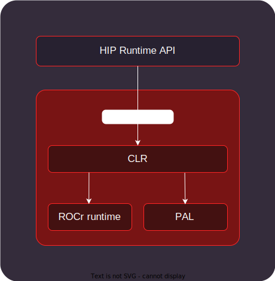

.. meta::
  :description: HIP runtime API usage
  :keywords: AMD, ROCm, HIP, HIP runtime API How to,

.. _hip_runtime_api_how-to:

********************************************************************************
Using HIP runtime API
********************************************************************************

The HIP runtime API provides C and C++ functionalities to manage event, stream,
and memory on GPUs. The HIP runtime uses :doc:`Compute Language Runtime (CLR) <../understand/amd_clr>`.

CLR contains source code for AMD ROCm's compute language runtimes: ``HIP`` and
``OpenCL™``. CLR includes the ``HIP`` implementation on the AMD ROCm
platform: `hipamd <https://github.com/ROCm/rocm-systems/tree/develop/projects/clr/hipamd>`_ and the
ROCm Compute Language Runtime (``rocclr``). ``rocclr`` is a
virtual device interface that enables the HIP runtime to interact with
different backends, such as :doc:`ROCr <rocr-runtime:index>` on Linux or PAL on
Microsoft Windows. CLR also includes the `OpenCL runtime <https://github.com/ROCm/rocm-systems/tree/develop/projects/clr/opencl>`_
implementation.

The HIP runtime API backends are summarized in the following figure:

Here are the various HIP Runtime API high level functions:

* :doc:`./hip_runtime_api/initialization`
* :doc:`./hip_runtime_api/memory_management`
* :doc:`./hip_runtime_api/error_handling`
* :doc:`./hip_runtime_api/asynchronous`
* :doc:`./hip_runtime_api/cooperative_groups`
* :doc:`./hip_runtime_api/hipgraph`
* :doc:`./hip_runtime_api/call_stack`
* :doc:`./hip_runtime_api/multi_device`
* :doc:`./hip_runtime_api/opengl_interop`
* :doc:`./hip_runtime_api/external_interop`
