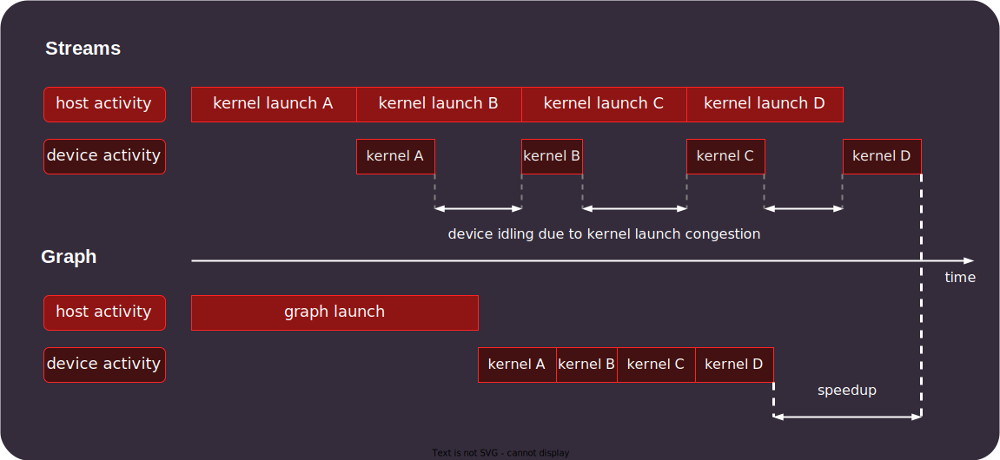

.. meta::
    :description: This chapter describes how to use HIP graphs and highlights their use cases.
    :keywords: ROCm, HIP, graph, stream

.. _how_to_HIP_graph:

********************************************************************************
HIP graphs
********************************************************************************

HIP graphs are an alternative way of executing tasks on a GPU that can provide
performance benefits over launching kernels using the standard
method via streams. A HIP graph is made up of nodes and edges. The nodes of a
HIP graph represent the operations performed, while the edges mark dependencies
between those operations.

.. hint::
    The :ref:`HIP Graph API tutorial <hip_graph_api_tutorial>` demonstrates how
    to use HIP graphs in a real-world application.

The nodes can be one of the following:

- empty nodes
- nested graphs
- kernel launches
- host-side function calls
- HIP memory functions (copy, memset, ...)
- HIP events
- signalling or waiting on external semaphores

.. note::
    The available node types are specified by :cpp:enum:`hipGraphNodeType`.

The following figure visualizes the concept of graphs, compared to using streams.

.. figure:: ../../data/how-to/hip_runtime_api/hipgraph/hip_graph.svg
    :alt: Diagram depicting the difference between using streams to execute
          kernels with dependencies, resolved by explicitly synchronizing,
          or using graphs, where the edges denote the dependencies.

The standard method of launching kernels incurs a small overhead for each
iteration of the operation involved. That overhead is negligible, when the
kernel is launched directly with the HIP C/C++ API, but depending on the
framework used, there can be several levels of redirection, until the actual
kernel is launched by the HIP runtime, leading to significant overhead.
Especially for some AI frameworks, a GPU kernel might run faster than the time
it takes for the framework to set up and launch the kernel, and so the overhead
of repeatedly launching kernels can have a significant impact on performance.

HIP graphs are designed to address this issue, by predefining the HIP API calls
and their dependencies with a graph, and performing most of the initialization
beforehand. Launching a graph only requires a single call, after which the
HIP runtime takes care of executing the operations within the graph.
Graphs can provide additional performance benefits, by enabling optimizations
that are only possible when knowing the dependencies between the operations.

          HIP streams when launching many short-running kernels.

    Qualitative presentation of the execution time of many short-running kernels
    when launched using HIP stream versus HIP graph. This does not include the
    time needed to set up the graph.

Using HIP graphs
================================================================================

There are two different ways of creating graphs: Capturing kernel launches from
a stream, or explicitly creating graphs. The difference between the two
approaches is explained later in this chapter.

The general flow for using HIP graphs includes the following steps.

#. Create a :cpp:type:`hipGraph_t` graph template using one of the two approaches described in this chapter
#. Create a :cpp:type:`hipGraphExec_t` executable instance of the graph template using :cpp:func:`hipGraphInstantiate`
#. Use :cpp:func:`hipGraphLaunch` to launch the executable graph to a stream
#. After execution completes free and destroy graph resources

The first two steps are the initial setup and only need to be executed once. First
step is the definition of the operations (nodes) and the dependencies (edges)
between them. The second step is the instantiation of the graph. This takes care
of validating and initializing the graph, to reduce the overhead when executing
the graph. The third step is the execution of the graph, which takes care of
launching all the kernels and executing the operations while respecting their
dependencies and necessary synchronizations as specified.

Because HIP graphs require some setup and initialization overhead before their
first execution, graphs only provide a benefit for workloads that require
many iterations to complete.

In both methods the :cpp:type:`hipGraph_t` template for a graph is used to define the graph.
In order to actually launch a graph, the template needs to be instantiated using
:cpp:func:`hipGraphInstantiate`, which results in an executable graph of type :cpp:type:`hipGraphExec_t`.
This executable graph can then be launched with :cpp:func:`hipGraphLaunch`, replaying the
operations within the graph. Note, that launching graphs is fundamentally no
different to executing other HIP functions on a stream, except for the fact,
that scheduling the operations within the graph encompasses less overhead and
can enable some optimizations, but they still need to be associated with a stream for execution.

Memory management
--------------------------------------------------------------------------------

Memory that is used by operations in graphs can either be pre-allocated or
managed within the graph. Graphs can contain nodes that take care of allocating
memory on the device or copying memory between the host and the device.
Whether you want to pre-allocate the memory or manage it within the graph
depends on the use-case. If the graph is executed in a tight loop the
performance is usually better when the memory is preallocated, so that it
does not need to be reallocated in every iteration.

The same rules as for normal memory allocations apply for memory allocated and
freed by nodes, meaning that the nodes that access memory allocated in a graph
must be ordered after allocation and before freeing.

Memory management within the graph enables the runtime to take care of memory reuse and optimizations.
The lifetime of memory managed in a graph begins when the execution reaches the
node allocating the memory, and ends when either reaching the corresponding
free node within the graph, or after graph execution when a corresponding
:cpp:func:`hipFreeAsync` or :cpp:func:`hipFree` call is reached.
The memory can also be freed with a free node in a different graph that is
associated with the same memory address.

Unlike device memory that is not associated with a graph, this does not necessarily
mean that the freed memory is returned back to the operating system immediately.
Graphs can retain a memory pool for quickly reusing memory within the graph.
This can be especially useful when memory is freed and reallocated later on
within a graph, as that memory doesn't have to be requested from the operating system.
It also potentially reduces the total memory footprint of the graph, by reusing the same memory.

The amount of memory allocated for graph memory pools on a specific device can
be queried using :cpp:func:`hipDeviceGetGraphMemAttribute`.
In order to return the freed memory :cpp:func:`hipDeviceGraphMemTrim` can be used.
This will return any memory that is not in active use by graphs.

These memory allocations can also be set up to allow access from multiple GPUs,
just like normal allocations. HIP then takes care of allocating and mapping the
memory to the GPUs. When capturing a graph from a stream, the node sets the
accessibility according to :cpp:func:`hipMemPoolSetAccess` at the time of capturing.

Capture graphs from a stream
================================================================================

The easy way to integrate HIP graphs into already existing code is to use
:cpp:func:`hipStreamBeginCapture` and :cpp:func:`hipStreamEndCapture` to obtain a :cpp:type:`hipGraph_t`
graph template that includes the captured operations.

When starting to capture operations for a graph using :cpp:func:`hipStreamBeginCapture`,
the operations assigned to the stream are captured into a graph instead of being
executed. The associated graph is returned when calling :cpp:func:`hipStreamEndCapture`, which
also stops capturing operations.
In order to capture to an already existing graph use :cpp:func:`hipStreamBeginCaptureToGraph`.

The functions assigned to the capturing stream are not executed, but instead are
captured and defined as nodes in the graph, to be run when the instantiated
graph is launched.

Functions must be associated with a stream in order to be captured.
This means that non-HIP API functions are not captured by default, but are
executed as standard functions when encountered and not added to the graph.
In order to assign host functions to a stream use
:cpp:func:`hipLaunchHostFunc`, as shown in the following code example.
They will then be captured and defined as a host node in the resulting graph,
and won't be executed when encountered.

Synchronous HIP API calls that are implicitly assigned to the default stream are
not permitted while capturing a stream  and will return an error. This is
because they implicitly synchronize and cause a dependency that can not be
captured within the stream. This includes functions like :cpp:func:`hipMalloc`,
:cpp:func:`hipMemcpy` and :cpp:func:`hipFree`. In order to capture these to the stream, replace
them with the corresponding asynchronous calls like :cpp:func:`hipMallocAsync`, :cpp:func:`hipMemcpyAsync` or :cpp:func:`hipFreeAsync`.

The general flow for using stream capture to create a graph template is:

#. Create a stream from which to capture the operations

#. Call :cpp:func:`hipStreamBeginCapture` before the first operation to be captured

#. Call :cpp:func:`hipStreamEndCapture` after the last operation to be captured

   #. Define a :cpp:type:`hipGraph_t` graph template to which :cpp:func:`hipStreamEndCapture`
      passes the captured graph

The following code is an example of how to use the HIP graph API to capture a
graph from a stream.

.. literalinclude:: ../../tools/example_codes/graph_capture.hip
    :start-after: // [sphinx-start]
    :end-before: // [sphinx-end]
    :language: cpp

Explicit graph creation
================================================================================

Graphs can also be created directly using the HIP graph API, giving more
fine-grained control over the graph. In this case, the graph nodes are created
explicitly, together with their parameters and dependencies, which specify the
edges of the graph, thereby forming the graph structure.

The nodes are represented by the generic :cpp:type:`hipGraphNode_t` type. The actual
node type is implicitly defined by the specific function used to add the node to
the graph, for example :cpp:func:`hipGraphAddKernelNode` See the
:ref:`HIP graph API documentation<graph_management_reference>` for the
available functions, they are of type ``hipGraphAdd{Type}Node``. Each type of
node also has a predefined set of parameters depending on the operation, for
example :cpp:class:`hipKernelNodeParams` for a kernel launch. See the
:doc:`documentation for the general hipGraphNodeParams type<../../doxygen/html/structhip_graph_node_params>`
for a list of available parameter types and their members.

The general flow for explicitly creating a graph is usually:

#. Create a graph :cpp:type:`hipGraph_t`

#. Create the nodes and their parameters and add them to the graph

   #. Define a :cpp:type:`hipGraphNode_t`

   #. Define the parameter struct for the desired operation, by explicitly setting the appropriate struct's members.

   #. Use the appropriate ``hipGraphAdd{Type}Node`` function to add the node to the graph.

      #. The dependencies can be defined when adding the node to the graph, or afterwards by using :cpp:func:`hipGraphAddDependencies`

The following code example demonstrates how to explicitly create nodes in order to create a graph.

.. literalinclude:: ../../tools/example_codes/graph_creation.hip
    :start-after: // [sphinx-start]
    :end-before: // [sphinx-end]
    :language: cpp
