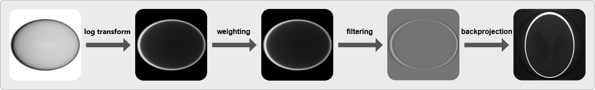
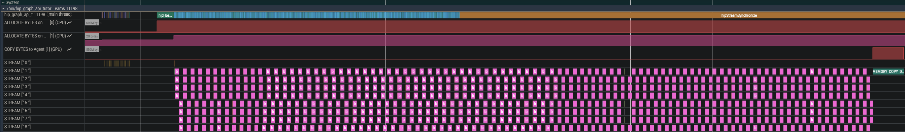
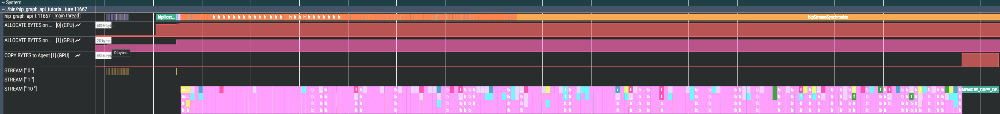
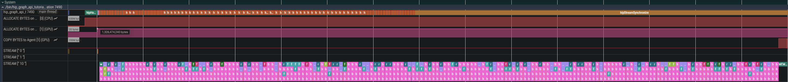

.. meta::
  :description: HIP graph API tutorial
  :keywords: AMD, ROCm, HIP, graph API, tutorial

.. _hip_graph_api_tutorial:

*******************************************************************************
HIP Graph API Tutorial
*******************************************************************************

**Time to complete**: 60 minutes | **Difficulty**: Intermediate | **Domain**: Medical Imaging

Introduction
============

Imagine you are directing a movie. In traditional GPU programming with streams, you are like a director who must call
"action!" for every single shot, waiting between each take. With HIP graphs, you pre-plan the entire scene sequence and
then call "action!" just once to film everything in one go. This tutorial will show you how to transform your GPU
applications from repeated direction to choreographed performance.

Modeling dependencies between GPU operations
--------------------------------------------

Most movies in the world follow a plot where certain scenes must happen before the following scenes; otherwise the
movie might not make much sense. If a scene *A* must happen before scenes *B* and *C*, *B* and *C* depend on *A*. If
*B* and *C* contain different stories that (at this point) are unrelated to each other, *B* and *C* are independent and
can be shown to the audience in any order. However, both scenes might be a prerequisite for the final scene *D*, so *D*
depends on both of them. When you represent scenes as *nodes* and dependencies as *edges*, you can create a graph, and
the graph representing your imaginary movie script will have a diamond-like shape:

.. figure:: ../data/tutorial/graph_api/diamond.svg
  :alt: Diagram showing a graph with diamond-like shape. Nodes represent movie scenes and edges represent dependencies
        between scenes.
  :align: center

You can think about GPU operations in a similar way. For example, most kernels require at least one data buffer to work
with, so they will depend on a preceding copy or ``memset`` operation. Others might process the results of preceding
kernels. Real-world applications typically involve multiple GPU operations with dependencies between them. HIP offers
two ways to think about and model these dependencies: streams and graphs.

Streams
^^^^^^^

Streams are HIP's default model for organizing and launching GPU operations on the device. They are sequential sets of
operations, similar to CPU threads. Adding operation *A* before operation *B* to a stream ensures *A* happens before
*B*, regardless of any interdependencies (or lack thereof) between them. A stream can be thought of as a first-in,
first-out (FIFO) queue of operations.

Multiple streams operate independently, and manual synchronization is required when dependencies cross stream
boundaries. Additionally, each operation in a stream is scheduled independently, which — depending on the complexity of
the enqueued operation — might lead to noticeable CPU launch overhead and kernel dispatch latency, especially for
workloads with many small kernels. However, applications that use streams are well suited for workloads that are
dynamic and unpredictable.

For more information about HIP streams, see :ref:`asynchronous_how-to`.

Graphs
^^^^^^

HIP graphs model dependencies between operations as nodes and edges on a diagram. Each node in the graph represents an
operation, and each edge represents a dependency between two nodes. If no edge exists between two nodes, they are
independent and can execute in any order.

Because dependency information is built into the graph, the HIP runtime automatically inserts the necessary
synchronization points. Launching all operations in a graph requires only a single API call, reducing launch overhead
and dispatch latency to near-zero. This is especially beneficial for workloads with many small kernels, where launch
overhead can dominate overall execution time.

Graphs must be defined once before use, making them ideal for fixed workflows that run repeatedly. While node
parameters can be updated between executions, the graph structure itself cannot change after instantiation. This
structural immutability is the primary trade-off compared to the flexibility of streams.

For more information about HIP graphs, see :ref:`how_to_HIP_graph`.

When to use graphs
^^^^^^^^^^^^^^^^^^

This table shows when to use graphs in your application.

.. list-table::
  :header-rows: 1
  :class: decision-matrix

  * - ✅ **Use Graphs When**
    - ❌ **Avoid Graphs When**
  * - Workflow is fixed and repetitive
    - Workflow changes dynamically
  * - Same kernels execute many times
    - One-shot operations
  * - Launch overhead is significant (many small kernels)
    - Kernels are long-running

Transitioning a CT reconstruction pipeline
------------------------------------------

In this tutorial, you will modify an existing GPU-accelerated stream-based image processing pipeline that reconstructs
computer tomography (CT) data (the classic Shepp-Logan phantom [ShLo74]_). The pipeline transforms raw X-ray
projections into clear cross-sectional images used in medical diagnosis.

.. note::
  The tutorial application generates a phantom volume and forward projections. This GPU-accelerated operation uses
  multiple streams and appears in the traces. You can ignore the dataset generation — it is not relevant to this
  tutorial.

The reconstruction pipeline consists of:

1. **Load** projection data into GPU memory
2. **Preprocess** the projection through six stages:

  a. Logarithmic transformation (convert X-ray intensities)
  b. Pixel weighting (correct for cone-beam geometry)
  c. Forward FFT (transform to frequency domain)
  d. Shepp-Logan filtering (enhance edges and improve contrast)
  e. Inverse FFT (return to spatial domain)
  f. Normalization (account for unnormalized FFT)

3. **Reconstruct** the 3D volume using the Feldkamp-Davis-Kress (FDK) algorithm [FeDK84]_

**Why HIP graphs?** CT scanners process hundreds of projections per scan. By capturing this fixed workflow as a graph,
you will reduce the amount of API calls required for launching the workflow on a GPU to 1 per projection, thus reducing
launch overhead and dispatch latency to near-zero.

What you will learn
-------------------

After completing this tutorial, you will be able to:

* Convert a stream-based HIP application to a graph-based application via stream capturing
* Create graphs manually for fine-grained control
* Integrate graph-safe libraries like hipFFT into your graphs
* Understand when graphs provide performance benefits
* Apply graph concepts to your own workflows

Before you begin
----------------

Required knowledge
^^^^^^^^^^^^^^^^^^

You should be comfortable writing and debugging HIP kernels, understand basic GPU memory management concepts like
device allocation and host-to-device transfers, be familiar with HIP streams and events, and have experience using
CMake to build C++ projects. This tutorial assumes you have written at least a few HIP programs before and understand
concepts like grid dimensions and thread blocks.

Hardware and software requirements
^^^^^^^^^^^^^^^^^^^^^^^^^^^^^^^^^^

Your system needs ROCm 6.2 or later with the hipFFT library installed. The tutorial works on
all :doc:`supported AMD GPUs <rocm-install-on-linux:reference/system-requirements>`, though at least 4 GiB of GPU
memory are recommended for comfortable performance with the reconstruction workload. You will also need
`git <https://git-scm.com/>`__ to check out the code repository, `CMake <https://www.cmake.org>`__ 3.21 or later to
build the code, along with a CMake generator that supports the HIP language such as GNU Make or Ninja.

.. note::
  Visual Studio generators currently do not support HIP. The (optional) ``rocprofv3`` tool is currently supported on
  Linux only.

To save the output volume, you need a recent version of `libTIFF <https://libtiff.gitlab.io/libtiff/>`__. If CMake
cannot find libTIFF on your system, it automatically downloads and builds it.

To view both the input projections and the output volume produced by this tutorial, install a scientific image viewer
that can display 16-bit and 32-bit grayscale data, such as `Fiji <https://imagej.net/software/fiji/downloads>`__.
Standard image viewers may be unable to correctly display the output.

Optional knowledge
^^^^^^^^^^^^^^^^^^

While not required, familiarity with Fast Fourier Transform (FFT) operations will help you understand the filtering
steps. Similarly, knowledge of medical imaging or CT reconstruction is helpful for understanding the application
context. If you have worked with signal processing or image filtering before, you will recognize some of the applied
concepts.

.. note::
  You can skip the reconstruction algorithm and concentrate on the stream and graph implementations in the files
  prefixed with ``main_``.

Step 1: Build the tutorial code
===============================

The full code for this tutorial is part of the `ROCm examples repository <https://github.com/ROCm/rocm-examples>`__.
Check out the repository:

.. code-block:: bash

  git clone https://github.com/ROCm/rocm-examples.git

Then navigate to ``rocm-examples/HIP-Doc/Tutorials/graph_api/``. The code can be found in the ``src`` subdirectory.

Create a separate ``build`` directory inside ``rocm-examples/HIP-Doc/Tutorials/graph_api/``. Then 
configure the project (adjust ``CMAKE_HIP_ARCHITECTURES`` to match your GPU):

.. code-block:: bash

  cd build
  cmake -DCMAKE_PREFIX_PATH=/opt/rocm -DCMAKE_BUILD_TYPE=Release -DCMAKE_HIP_ARCHITECTURES=gfx1100 -DCMAKE_HIP_PLATFORM=amd -DCMAKE_CXX_COMPILER=amdclang++ -DCMAKE_C_COMPILER=amdclang -DCMAKE_HIP_COMPILER=amdclang++ ..

Now you can build the three variants of the tutorial code:

.. code-block:: bash

  cmake --build . --target hip_graph_api_tutorial_streams hip_graph_api_tutorial_graph_capture hip_graph_api_tutorial_graph_creation

.. note::
  The ``graph_capture`` variant is currently not supported on Windows and the build target is therefore unavailable.

Step 2: Examining the stream-based baseline application
=======================================================

Open ``src/main_streams.hip`` in your editor. You will explore how this application processes data.

Understanding batched processing
--------------------------------

The application processes multiple projections simultaneously to maximize GPU utilization.

Determining parallel capacity
^^^^^^^^^^^^^^^^^^^^^^^^^^^^^

At the beginning of ``main()``, the program queries the GPU for its number of asynchronous engines to determine how
many streams it can create, indicating how many data transfer or compute operations can run in parallel.

.. literalinclude:: ../tools/example_codes/graph_api_tutorial_main_streams.hip
  :start-after: // [sphinx-async-engine-start]
  :end-before: // [sphinx-async-engine-end]
  :language: cuda
  :dedent:

.. tip::
  Each asynchronous engine executes operations independently. More engines mean more parallelism.

Processing projections in batches
^^^^^^^^^^^^^^^^^^^^^^^^^^^^^^^^^

Find the ``MAIN LOOP`` comment. Here the application groups projections into parallel batches:

.. literalinclude:: ../tools/example_codes/graph_api_tutorial_main_streams.hip
  :start-after: // [sphinx-batch-start]
  :end-before: // [sphinx-batch-end]
  :language: cuda
  :dedent:

Notice how each batch size equals the stream count — this ensures every stream stays busy.

Synchronization
^^^^^^^^^^^^^^^

Each projection processes independently, so you only need to synchronize once at the end.
:cpp:func:`hipStreamWaitEvent()` function makes the first stream wait for all other streams to complete.

.. literalinclude:: ../tools/example_codes/graph_api_tutorial_main_streams.hip
  :start-after: // [sphinx-sync-start]
  :end-before: // [sphinx-sync-end]
  :language: cuda
  :dedent:

Exploring the processing pipeline
---------------------------------

Next, examine what happens to each projection. Find the ``START HERE`` comment to see the reconstruction pipeline's
first steps:

.. literalinclude:: ../tools/example_codes/graph_api_tutorial_main_streams.hip
  :start-after: // [sphinx-preprocessing-start]
  :end-before: // [sphinx-preprocessing-end]
  :language: cuda
  :dedent:

This is a typical pattern found across many HIP applications: multiple kernels executing in sequence with data
dependencies. In the next step, the weighted projections need to be transformed into Fourier space and filtered. For
optimal performance, it is recommended to execute a 1D FFT on a buffer size which is a power of two. Copy the weighted
projection to another buffer where the row length is a power of two equal to or larger than the projection's row
length:

.. literalinclude:: ../tools/example_codes/graph_api_tutorial_main_streams.hip
  :start-after: // [sphinx-proj-to-expanded-start]
  :end-before: // [sphinx-proj-to-expanded-end]
  :language: cuda
  :dedent:

Next, transform the expanded projection into Fourier space for filtering:

.. literalinclude:: ../tools/example_codes/graph_api_tutorial_main_streams.hip
  :start-after: // [sphinx-forward-start]
  :end-before: // [sphinx-forward-end]
  :language: cuda
  :dedent:

.. tip::
  Some hipFFT operations are graph-safe: As long as these operations are operating on the capturing stream, they will
  be captured into the graph as well. Refer to :ref:`hipFFT's documentation <hipfft:hipfft-api-usage>` for more
  information on its graph-safe operations.

In Fourier space, apply the Shepp-Logan filter, then transform back:

.. literalinclude:: ../tools/example_codes/graph_api_tutorial_main_streams.hip
  :start-after: // [sphinx-filter-start]
  :end-before: // [sphinx-filter-end]
  :language: cuda
  :dedent:

Shrink to original size and normalize the FFT output:

.. literalinclude:: ../tools/example_codes/graph_api_tutorial_main_streams.hip
  :start-after: // [sphinx-expanded-to-proj-start]
  :end-before: // [sphinx-expanded-to-proj-end]
  :language: cuda
  :dedent:

Finally, back-project the filtered projection into the 3D volume using ``atomicAdd`` operations to accumulate voxel
values from multiple kernels:

.. literalinclude:: ../tools/example_codes/graph_api_tutorial_main_streams.hip
  :start-after: // [sphinx-bp-start]
  :end-before: // [sphinx-bp-end]
  :language: cuda
  :dedent:

.. note::
  The preprocessing kernels process 512 × 512 pixels (:math:`\mathcal{O}(n²)`), while the back-projection kernel
  processes 512 × 512 × 512 voxels (:math:`\mathcal{O}(n³)`). This cubic complexity makes back-projection the
  computational bottleneck.

Creating a trace file
^^^^^^^^^^^^^^^^^^^^^

Inside the ``build`` directory you will now generate a trace:

.. code-block:: bash

  rocprofv3 -o streams -d outDir -f pftrace --hip-trace --kernel-trace --memory-copy-trace --memory-allocation-trace -- ./bin/hip_graph_api_tutorial_streams

.. note::
  For more information on the ``rocprofv3`` tool, please refer to its
  :ref:`documentation <rocprofiler-sdk:using-rocprofv3>`.

Analyzing the trace
^^^^^^^^^^^^^^^^^^^

Open the trace file to see what is really happening:

1. Navigate to your ``build/outDir`` directory
2. Open ``streams_results.pftrace`` in `Perfetto <https://ui.perfetto.dev>`__
3. Click the arrow next to your executable name under ``System``
4. Focus on the kernel execution pattern on the right

While projections process in parallel, there are visible gaps between operations. These gaps represent overhead caused
by scheduling and launching the operations. In the next section, you will eliminate these gaps by capturing streams into
a graph.

Step 3: Converting to graphs via stream capture
===============================================

Stream capture is a feature that allows you to record a sequence of GPU operations (kernel launches, memory copies,
etc.) into a HIP Graph, which can later be executed as a single, optimized unit. Open the file
``src/main_graph_capture.hip``, which contains the code from the previous subsection, with a few changes that allow you
to capture the streams into a single graph.

Before the main loop, declare graph-specific variables:

.. literalinclude:: ../tools/example_codes/graph_api_tutorial_main_graph_capture.hip
  :start-after: // [sphinx-graph-vars-start]
  :end-before: // [sphinx-graph-vars-end]
  :language: cuda
  :dedent:

``graphExec`` and ``graphExecFinal`` will be instances of the graph template that you will create in the following
steps. You will typically instantiate a graph template once and update its parameters for repeated launches. If the
graph topology changes, you will need a new instance. The ``graphStream`` will launch the final graph instances.

Inside the main loop, activate capture mode on the first stream:

.. literalinclude:: ../tools/example_codes/graph_api_tutorial_main_graph_capture.hip
  :start-after: // [sphinx-begin-capture-start]
  :end-before: // [sphinx-begin-capture-end]
  :language: cuda
  :dedent:

.. admonition:: What happens during capture?

  When :cpp:func:`hipStreamBeginCapture` is called, the stream stops executing operations immediately. Instead, it
  records operations into a graph template (``graph`` in the code shown here).

To capture multiple streams, use events to implement the fork-join pattern:

.. literalinclude:: ../tools/example_codes/graph_api_tutorial_main_graph_capture.hip
  :start-after: // [sphinx-fork-start]
  :end-before: // [sphinx-fork-end]
  :language: cuda
  :dedent:

This creates dependencies between streams, activating capture mode on the additional streams and ensuring they are all
part of the same graph.

**The processing pipeline itself remains unchanged.**

After recording all operations of the current batch, join the streams:

.. literalinclude:: ../tools/example_codes/graph_api_tutorial_main_graph_capture.hip
  :start-after: // [sphinx-join-start]
  :end-before: // [sphinx-join-end]
  :language: cuda
  :dedent:

Then stop capturing:

.. literalinclude:: ../tools/example_codes/graph_api_tutorial_main_graph_capture.hip
  :start-after: // [sphinx-stop-capture-start]
  :end-before: // [sphinx-stop-capture-end]
  :language: cuda
  :dedent:

The graph template is now complete. In order to execute the recorded operations, you need to instantiate the graph
and execute it on the ``graphStream``. The graph template can be safely destroyed after instantiating:

.. literalinclude:: ../tools/example_codes/graph_api_tutorial_main_graph_capture.hip
  :start-after: // [sphinx-graph-instantiate-start]
  :end-before: // [sphinx-graph-instantiate-end]
  :language: cuda
  :dedent:

.. tip::
  Use :cpp:func:`hipGraphDebugDotPrint` to save a graph's topology into a ``*.dot`` file. The resulting file
  contains a `DOT <https://graphviz.org/doc/info/lang.html>`__ description which can be processed with
  `Graphviz <https://graphviz.org/>`__ or visualized with several tools. For example:

  .. code-block:: bash

    dot -Tpng graph_capture.dot -o graph_capture.png

Instantiating a graph is a relatively costly operation. However, you need to update the parameters whenever a new batch
is processed. Since the graph templates are the same for all batches (i.e., the topology of the resulting graph does
not change), it is sufficient to update the existing graph instance's parameters instead of creating a new instance:

.. literalinclude:: ../tools/example_codes/graph_api_tutorial_main_graph_capture.hip
  :start-after: // [sphinx-graph-update-start]
  :end-before: // [sphinx-graph-update-end]
  :language: cuda
  :dedent:

Should the graph's topology change between iterations, it is necessary to create a new graph instance. In your
application's case, this can happen when the number of projections is not evenly divisible by the number of
asynchronous engines:

.. literalinclude:: ../tools/example_codes/graph_api_tutorial_main_graph_capture.hip
  :start-after: // [sphinx-graph-final-start]
  :end-before: // [sphinx-graph-final-end]
  :language: cuda
  :dedent:

Creating a trace
----------------

Now you have successfully converted the processing pipeline into an executable graph. You can examine the effects of
this change and generate another trace:

.. code-block:: bash

  rocprofv3 -o graph_capture -d outDir -f pftrace --hip-trace --kernel-trace --memory-copy-trace --memory-allocation-trace -- ./bin/hip_graph_api_tutorial_graph_capture

Analyzing the trace
-------------------

Opening the resulting trace file ``outDir/graph_capture_results.pftrace`` with Perfetto shows a significant change:

The gaps have disappeared! By capturing all operations of a batch into a single graph, you have successfully
eliminated the launching and scheduling overhead previously observed in the stream-based variant.

A limitation of stream capture is that it preserves stream ordering even when unnecessary. Operations that could run in
parallel still execute sequentially. Another approach to graphs is manual construction. This is quite verbose but also
offers much more control over dependencies and parallelism.

Step 4: Manual graph creation (advanced)
========================================

Open ``src/main_graph_creation.hip`` and find the main loop. The code here differs from the other variants: rather than
capturing streams into graphs, you will build the graph manually. Consider how the weighting kernel is invoked through
a kernel node:

.. literalinclude:: ../tools/example_codes/graph_api_tutorial_main_graph_creation.hip
  :start-after: // [sphinx-weighting-node-start]
  :end-before: // [sphinx-weighting-node-end]
  :language: cuda
  :dedent:

You create an array of ``void*`` pointers containing the kernel parameters. Next, configure the kernel launch
parameters: grid and block dimensions, the kernel function pointer, and the dynamic shared memory size. Finally, add
the kernel node to the graph template. Note the ``&logTransformationKernelNode, 1`` part: this is how you specify a
dependency from the preceding log transformation kernel node to the weighting kernel node.

.. note::
  For specifying multiple dependencies, you would pass an array of :cpp:type:`hipGraphNode_t` objects and the number of
  nodes inside the array to :cpp:func:`hipGraphAddKernelNode`.

The HIP graph API supports multiple different node types. For example, this is how a ``memset`` node is set up:

.. literalinclude:: ../tools/example_codes/graph_api_tutorial_main_graph_creation.hip
  :start-after: // [sphinx-memset-node-start]
  :end-before: // [sphinx-memset-node-end]
  :language: cuda
  :dedent:

.. note::
  Despite the different construction method, graph instantiation and updates
  work exactly as before. You can find the same patterns at the loop's end.

Adding hipFFT nodes
-------------------

While hipFFT provides graph-safe functionality, it does not support manual node creation. Integrating hipFFT into the
graph requires a workaround using stream capture with additional bookkeeping.

You capture the graph state before and after hipFFT operations, then identify the nodes hipFFT added:

Step 1: Save existing nodes
^^^^^^^^^^^^^^^^^^^^^^^^^^^

Record all current graph nodes in a sorted ``std::set``:

.. literalinclude:: ../tools/example_codes/graph_api_tutorial_main_graph_creation.hip
  :start-after: // [sphinx-before-forward-start]
  :end-before: // [sphinx-before-forward-end]
  :language: cuda
  :dedent:

Step 2: Capture hipFFT operations
^^^^^^^^^^^^^^^^^^^^^^^^^^^^^^^^^

.. literalinclude:: ../tools/example_codes/graph_api_tutorial_main_graph_creation.hip
  :start-after: // [sphinx-hipfft-start]
  :end-before: // [sphinx-hipfft-end]
  :language: cuda
  :dedent:

Step 3: Get updated node list
^^^^^^^^^^^^^^^^^^^^^^^^^^^^^

.. literalinclude:: ../tools/example_codes/graph_api_tutorial_main_graph_creation.hip
  :start-after: // [sphinx-after-forward-start]
  :end-before: // [sphinx-after-forward-end]
  :language: cuda
  :dedent:

Step 4: Find new nodes
^^^^^^^^^^^^^^^^^^^^^^

Compute the difference between both node sets:

.. literalinclude:: ../tools/example_codes/graph_api_tutorial_main_graph_creation.hip
  :start-after: // [sphinx-node-difference-start]
  :end-before: // [sphinx-node-difference-end]
  :language: cuda
  :dedent:

Step 5: Identify the leaf node
^^^^^^^^^^^^^^^^^^^^^^^^^^^^^^

Find hipFFT's final node for dependency tracking:

.. literalinclude:: ../tools/example_codes/graph_api_tutorial_main_graph_creation.hip
  :start-after: // [sphinx-find-leaf-start]
  :end-before: // [sphinx-find-leaf-end]
  :language: cuda
  :dedent:

The leaf detection logic checks if a node has no outgoing edges:

.. literalinclude:: ../tools/example_codes/graph_api_tutorial_main_graph_creation.hip
  :start-after: // [sphinx-is-leaf-start]
  :end-before: // [sphinx-is-leaf-end]
  :language: cuda
  :dedent:

With hipFFT integrated and its leaf node identified, subsequent nodes can establish proper dependencies.

.. note::
  You can also capture hipFFT operations into a separate graph template, then add it to the main graph as a child graph
  using :cpp:func:`hipGraphAddChildGraphNode`. The approach above adds hipFFT nodes directly to the main graph as
  first-class nodes. A child graph acts as a single node that expands recursively into its components. The scheduler
  may handle these approaches differently, potentially affecting performance.

Creating a trace
----------------

Now you have manually implemented the processing pipeline with the graph API. You can examine the result by generating
another trace:

.. code-block:: bash
  
  rocprofv3 -o graph_creation -d outDir -f pftrace --hip-trace --kernel-trace --memory-copy-trace --memory-allocation-trace -- ./bin/hip_graph_api_tutorial_graph_creation

Analyzing the trace
-------------------

Opening the resulting trace file ``outDir/graph_creation_results.pftrace`` with Perfetto shows a similar trace to what
you achieved with the capture variant:

Like before, the kernels are executed *en bloc*. By creating nodes for all operations in the processing pipeline, you
avoided the launching and scheduling overhead you previously observed in the stream-based variant.

Updating individual nodes
-------------------------

The code presented in this tutorial updates the entire graph instance for each new batch. Applications that require
updates to only a small subset of nodes might experience excessive overhead. For these cases, the HIP Graph API
provides the following methods for updating individual nodes:

* :cpp:func:`hipGraphExecChildGraphNodeSetParams`
* :cpp:func:`hipGraphExecEventRecordNodeSetEvent`
* :cpp:func:`hipGraphExecEventWaitNodeSetEvent`
* :cpp:func:`hipGraphExecExternalSemaphoresSignalNodeSetParams`
* :cpp:func:`hipGraphExecExternalSemaphoresWaitNodeSetParams`
* :cpp:func:`hipGraphExecHostNodeSetParams`
* :cpp:func:`hipGraphExecKernelNodeSetParams`
* :cpp:func:`hipGraphExecMemcpyNodeSetParams`
* :cpp:func:`hipGraphExecMemcpyNodeSetParams1D`
* :cpp:func:`hipGraphExecMemcpyNodeSetParamsFromSymbol`
* :cpp:func:`hipGraphExecMemcpyNodeSetParamsToSymbol`
* :cpp:func:`hipGraphExecMemsetNodeSetParams`
* :cpp:func:`hipGraphExecNodeSetParams`

Conclusion
==========

When an application has predictable, repetitive workflows, transitioning from streams to graphs can significantly
reduce launch overhead and improve performance. HIP provides two approaches for creating graphs: stream capture and
explicit graph construction.

**Stream capture** converts existing stream-based code into a graph by recording the operations between start and stop
capture calls. This approach minimizes code changes and works well when your application already has a graph-like
structure with clear dependencies.

**Explicit graph construction** involves manually creating nodes and defining edges between them using the graph API.
While this approach requires more code changes and is more verbose, it provides fine-grained control over dependencies
and allows for optimizations that might not be possible with stream capture. This method is ideal when you need precise
control over the graph topology or when working with complex dependency patterns.

.. tip::
  Choose stream capture for quick conversions of existing code with minimal changes. Choose explicit construction when
  you need maximum control and optimization opportunities.

Resources
=========

* :ref:`HIP Programming Guide's section on HIP graphs <how_to_HIP_graph>`
* :ref:`HIP graph API reference <graph_management_reference>`

.. rubric:: References

.. [FeDK84] L.A. Feldkamp, L.C. Davis and J.W. Kress: "Practical cone-beam algorithm". In *Journal of the Optical Society of America A*, vol. 1, no. 6, pp. 612-619, June 1984, DOI `10.1364/JOSAA.1.000612 <https://dx.doi.org/10.1364/JOSAA.1.000612>`__.
.. [ShLo74] L.A. Shepp and B.F. Logan: "The Fourier reconstruction of a head section". In *IEEE Transactions on Nuclear Science*, vol. 21, no. 3, pp. 21-43, June 1974, DOI `10.1109/TNS.1974.6499235 <https://dx.doi.org/10.1109/TNS.1974.6499235>`__.