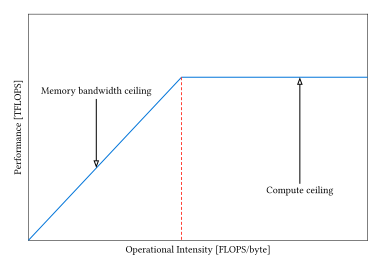

.. meta::
  :description: This chapter explains performance concepts and theoretical models for understanding AMD GPU performance
  :keywords: AMD, ROCm, HIP, performance, theory, roofline, occupancy, bandwidth, arithmetic intensity

.. _performance_optimization:

*******************************************************************************
Understanding GPU performance
*******************************************************************************

This chapter explains the theoretical foundations of GPU performance on AMD 
hardware. Understanding these concepts helps you analyze performance 
characteristics, identify bottlenecks, and make informed optimization decisions.

For practical optimization techniques and step-by-step guidance, see 
:doc:`../how-to/performance_guidelines`.

Performance bottlenecks
=======================

A performance bottleneck is the limiting factor that prevents a GPU kernel from 
achieving higher performance. The two primary categories are:

* **Compute-bound**: The kernel is limited by arithmetic throughput
* **Memory-bound**: The kernel is limited by memory bandwidth

Understanding which category applies helps identify the appropriate optimization 
approach. Compute-bound kernels benefit from arithmetic optimizations, while 
memory-bound kernels benefit from memory access improvements.

.. _roofline_model:

Roofline model
==============

The roofline model is a visual performance analysis framework that relates 
achievable performance to hardware limits based on arithmetic intensity.

The model plots performance (FLOPS) against arithmetic intensity (FLOPS/byte) 
with two limiting factors:

1. **Memory bandwidth ceiling**: A sloped line representing peak memory bandwidth
2. **Compute ceiling**: A horizontal line representing peak arithmetic throughput

The intersection point determines the transition between memory-bound and 
compute-bound regions. Kernels below and to the left of the intersection are 
memory-bound, while those to the right are compute-bound.

         ceiling
   :align: center
   :width: 100%

   Roofline model showing the relationship between arithmetic intensity and
   achievable performance. The memory bandwidth ceiling represents the GPU's
   memory bandwidth limit, while the compute ceiling shows the maximum
   achievable TFLOPs. Kernels falling into the area to the left of the red
   line are memory-bound, while they are compute-bound if they fall into the
   right area.

Key characteristics:

* The roofline creates an upper bound on achievable performance
* Real applications typically achieve a significant portion of the theoretical limit
* The model helps guide optimization efforts based on kernel characteristics

.. _compute_bound:

Compute-bound performance
=========================

A kernel is compute-bound when its performance is limited by the GPU's arithmetic 
throughput rather than memory bandwidth. These kernels have high arithmetic 
intensity and spend most cycles executing arithmetic operations.

Characteristics of compute-bound kernels:

* High ratio of arithmetic operations to memory accesses
* Performance scales with GPU compute capacity
* Limited benefit from memory bandwidth optimization
* Can often achieve a high percentage of peak theoretical FLOPS

The theoretical maximum is determined by:

* Number of compute units and SIMD lanes
* Clock frequency
* Instruction throughput per cycle
* Specialized unit capabilities (matrix cores, SFUs)

.. _memory_bound:

Memory-bound performance
========================

A kernel is memory-bound when its performance is limited by memory bandwidth 
rather than compute capacity. These kernels have low arithmetic intensity and 
spend significant time waiting for memory operations.

Characteristics of memory-bound kernels:

* Low ratio of arithmetic operations to memory accesses
* Performance scales with memory bandwidth
* Sensitive to memory access patterns
* Typically achieve lower percentage of peak FLOPS

The theoretical maximum is determined by:

* HBM bandwidth capacity
* Memory controller efficiency
* Cache hierarchy effectiveness
* Memory access pattern efficiency

.. _arithmetic_intensity:

Arithmetic intensity
====================

Arithmetic intensity is the ratio of floating-point operations (FLOPs) to memory 
traffic (bytes) for a given kernel or algorithm.

.. math::

   \text{Arithmetic Intensity} = \frac{\text{FLOPs}}{\text{Bytes Transferred}}

This metric determines whether a kernel is compute-bound or memory-bound.

Key points:

* Higher arithmetic intensity indicates more computation per byte transferred
* The balance point depends on the GPU's compute-to-bandwidth ratio
* It can be calculated theoretically or measured empirically
* Different precision types affect both FLOPs and bytes

For modern AMD GPUs:

* The compute-to-bandwidth ratio varies by GPU generation
* Higher-end models have higher ratios
* Kernels above the GPU's specific ratio are compute-bound

.. _latency_hiding:

Latency hiding mechanisms
==========================

GPUs hide memory and instruction latency through massive hardware multithreading 
rather than complex CPU techniques like out-of-order execution.

How latency hiding works:

* **Wavefront switching**: Context switches occur every cycle with zero overhead
* **Multiple wavefronts per CU**: Many concurrent wavefronts supported
* **Instruction-level parallelism**: Multiple independent instructions in flight

The hardware can completely hide memory latency if there are enough active 
wavefronts with independent work. The number of instructions required from other 
wavefronts to hide latency depends on the specific memory latency and instruction 
throughput characteristics of the GPU.

Requirements for effective latency hiding:

* Sufficient occupancy (active wavefronts)
* Independent instructions to overlap
* Balanced resource usage
* Minimal divergence

.. _wavefront_execution:

Wavefront execution states
==========================

A wavefront can be in one of several states during execution:

* **Active**: Currently executing on a SIMD unit
* **Ready**: Eligible for execution, waiting for scheduling
* **Stalled**: Waiting for a dependency (memory, synchronization)
* **Sleeping**: Blocked on a barrier or synchronization primitive

Understanding these states helps explain GPU utilization metrics:

* **Active cycles**: Percentage of cycles with at least one instruction executing
* **Stall cycles**: Percentage of cycles waiting for resources
* **Idle cycles**: No wavefronts available to execute

Maximizing active cycles while minimizing stall and idle cycles improves 
performance.

.. _occupancy:

Occupancy theory
================

Occupancy measures the ratio of active wavefronts to the maximum possible 
wavefronts on a compute unit.

.. math::

   \text{Occupancy} = \frac{\text{Active Wavefronts}}{\text{Max Wavefronts per CU}}

Why occupancy matters:

* Higher occupancy improves latency hiding
* More concurrent wavefronts mask memory and instruction latency
* Enables better utilization of execution units

Limiting factors:

* **Register usage**: VGPRs and SGPRs per thread
* **Shared memory (LDS)**: Allocation per block
* **Wavefront slots**: Hardware limit on concurrent wavefronts
* **Block size**: Small blocks may waste resources

Trade-offs:

* Higher occupancy improves latency hiding but reduces resources per thread
* Lower occupancy allows more resources per thread but may expose latency
* Optimal occupancy depends on kernel characteristics
* Memory-bound kernels benefit more from high occupancy

.. _memory_hierarchy_theory:

Memory hierarchy impact on performance
=======================================

The GPU memory hierarchy has different bandwidths and latencies:

Memory types by speed:

1. **Registers**: Fastest, lowest latency (per-thread storage)
2. **LDS (shared memory)**: Very fast, on-chip (per-block storage)
3. **L1 cache**: Fast, on-chip (per-CU cache)
4. **L2 cache**: Moderate, on-chip (shared across CUs)
5. **HBM (global memory)**: Slower, off-chip but high bandwidth

Memory coalescing theory
-------------------------

Memory coalescing combines memory accesses from multiple threads into fewer 
transactions. When consecutive threads access consecutive memory addresses, the 
hardware can merge requests into efficient cache line accesses.

Why coalescing matters:

* Reduces number of memory transactions
* Improves memory bandwidth utilization
* Decreases memory access latency

**Coalesced pattern**: Consecutive threads accessing consecutive addresses 
achieve high bandwidth utilization.

**Non-coalesced pattern**: Random or strided addresses result in many separate 
transactions and low bandwidth utilization.

.. _bank_conflicts_theory:

Bank conflict theory
--------------------

Shared memory (LDS) is organized into banks that can be accessed independently. 
Bank conflicts occur when multiple threads access different addresses in the 
same bank.

Why bank conflicts matter:

* Conflicts serialize accesses, reducing throughput
* LDS bandwidth drops proportionally to conflict degree
* Can turn parallel operations into sequential ones

Common patterns:

* **No conflict**: Each thread accesses a different bank (full bandwidth)
* **Broadcast**: Multiple threads read the same address (no conflict)
* **N-way conflict**: N threads access the same bank (1/N bandwidth)

.. _register_pressure_theory:

Register pressure theory
=========================

Register pressure occurs when a kernel requires more registers than optimal for 
the target occupancy.

Why register pressure matters:

* Reduces maximum occupancy
* May cause register spilling to memory
* Decreases ability to hide latency
* Lowers overall throughput

The relationship between registers and occupancy:

* More registers per thread → fewer concurrent wavefronts
* Fewer registers per thread → higher occupancy but may need memory spills
* Optimal balance depends on kernel memory access patterns

.. _performance_metrics_theory:

Performance metrics explained
==============================

Understanding performance metrics helps analyze GPU behavior:

Peak rate
---------

The theoretical maximum performance of a GPU:

* **Peak FLOPS**: Maximum floating-point operations per second
* **Peak bandwidth**: Maximum memory throughput
* **Peak instruction rate**: Maximum instructions per cycle

Actual performance is always below peak due to various inefficiencies.

Utilization metrics
-------------------

**Pipe utilization**: The percentage of execution cycles where the pipeline is 
actively processing instructions. Low utilization indicates stalls or insufficient 
work.

**Issue efficiency**: The ratio of issued instructions to the maximum possible. 
Low efficiency can indicate instruction cache misses, scheduling inefficiencies, 
or resource conflicts.

**CU utilization**: The percentage of compute units actively executing work. Low 
utilization suggests insufficient parallelism, load imbalance, or synchronization 
overhead.

**Branch efficiency**: The ratio of non-divergent to total branches. Low 
efficiency indicates significant divergence overhead.

Theoretical performance limits
==============================

Understanding theoretical limits helps set realistic performance expectations.

**Peak performance bounds**

Every GPU has theoretical maximum performance determined by:

* Clock frequency and number of compute units
* Instruction throughput per clock cycle
* Memory bandwidth capacity
* Specialized unit capabilities (matrix cores, SFUs)

**Achievable performance**

Real applications typically achieve a fraction of theoretical peak due to:

* Imperfect resource utilization
* Memory access inefficiencies
* Control flow divergence
* Synchronization overhead
* Launch and scheduling costs

The gap between theoretical and achieved performance reveals optimization 
opportunities. The roofline model provides a framework for understanding these 
limits and identifying which factor (compute or memory) constrains performance.

Summary
=======

Understanding GPU performance requires knowledge of several interconnected concepts:

* **Performance bottlenecks**: Whether compute or memory limits performance
* **Roofline model**: Visual framework for analyzing performance limits
* **Arithmetic intensity**: The compute-to-memory ratio of algorithms
* **Latency hiding**: How concurrent execution masks delays
* **Occupancy**: How wavefront concurrency affects resource utilization
* **Memory hierarchy**: How different memory types affect bandwidth
* **Performance metrics**: Quantitative measures for analysis

These theoretical foundations inform practical optimization decisions. For 
step-by-step optimization techniques and practical guidance, see 
:doc:`../how-to/performance_guidelines`.
