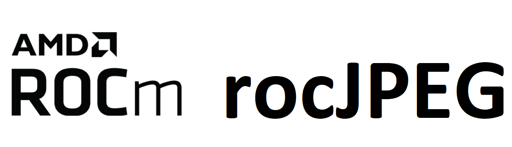

[](https://opensource.org/licenses/MIT)

<p align="center"></p>

rocJPEG is a high performance JPEG decode SDK for AMD GPUs. Using the rocJPEG API, you can access the JPEG decoding features available on your GPU.

>[!Note]
>The published documentation is available at [rocJPEG](https://rocm.docs.amd.com/projects/rocJPEG/en/latest/) in an organized, easy-to-read format, with search and a table of contents. The documentation source files reside in the `docs` folder of this repository. As with all ROCm projects, the documentation is open source. For more information on contributing to the documentation, see [Contribute to ROCm documentation](https://rocm.docs.amd.com/en/latest/contribute/contributing.html)

## Supported JPEG chroma subsampling

* YUV 4:4:4
* YUV 4:4:0
* YUV 4:2:2
* YUV 4:2:0
* YUV 4:0:0

## Prerequisites

### Operating Systems
* Linux
  * Ubuntu - `22.04` / `24.04`
  * RedHat - `8` / `9`
  * SLES - `15 SP7`

### Hardware
* **GPU**: [AMD Radeon&trade; Graphics](https://rocm.docs.amd.com/projects/install-on-linux/en/latest/reference/system-requirements.html) / [AMD Instinct&trade; Accelerators](https://rocm.docs.amd.com/projects/install-on-linux/en/latest/reference/system-requirements.html)

> [!IMPORTANT] 
> * `gfx908` or higher GPU required

* Install ROCm `6.3.0` or later with [amdgpu-install](https://rocm.docs.amd.com/projects/install-on-linux/en/latest/how-to/amdgpu-install.html): **Required** usecase:`rocm`
> [!IMPORTANT]
> `sudo amdgpu-install --usecase=rocm`

### Compiler
* AMD Clang++ Version 18.0.0 or later - installed with ROCm

### Libraries
* CMake Version `3.10` or later
  ```shell
  sudo apt install cmake
  ```

* Video Acceleration API - `libva-amdgpu-dev` is an AMD implementation for VA-API
  ```shell
  sudo apt install libva-amdgpu-dev
  ```
> [!NOTE]
> * RPM Packages for `RHEL`/`SLES` - `libva-amdgpu-devel`
> * `libva-amdgpu` is strongly recommended over system `libva` as it is used for building mesa-amdgpu-va-driver

* AMD VA Drivers
  ```shell
  sudo apt install libva2-amdgpu libva-amdgpu-drm2 libva-amdgpu-wayland2 libva-amdgpu-x11-2 mesa-amdgpu-va-drivers
  ```
> [!NOTE]
> RPM Packages for `RHEL`/`SLES` - `libva-amdgpu mesa-amdgpu-va-drivers`

* HIP
  ```shell
  sudo apt install hip-dev
  ```

> [!IMPORTANT]
> * Required compiler support
>   * C++17
>   * Threads
> * On Ubuntu 22.04 - Additional package required: libstdc++-12-dev
>  ```shell
>  sudo apt install libstdc++-12-dev
>  ```

>[!NOTE]
> * All package installs are shown with the `apt` package manager. Use the appropriate package manager for your operating system.

### Prerequisites setup script for Linux

For your convenience, we provide the setup script,
[rocJPEG-setup.py](rocJPEG-setup.py) which installs all required dependencies. Run this script only once.

**Usage:**

```shell
  python rocJPEG-setup.py  --rocm_path [ ROCm Installation Path - optional (default:/opt/rocm)]
```

**NOTE:** This script only needs to be executed once.

## Installation instructions

The installation process uses the following steps:

* [ROCm-supported hardware](https://rocm.docs.amd.com/projects/install-on-linux/en/latest/reference/system-requirements.html) install verification

* Install ROCm `6.3.0` or later with [amdgpu-install](https://rocm.docs.amd.com/projects/install-on-linux/en/latest/how-to/amdgpu-install.html) with `--usecase=rocm`

>[!IMPORTANT]
> Use **either** [package install](#package-install) **or** [source install](#source-install) as described below.

### Package install

Install rocJPEG runtime, development, and test packages.

* Runtime package - `rocjpeg` only provides the rocjpeg library `librocjpeg.so`
* Development package - `rocjpeg-dev`/`rocjpeg-devel` provides the library, header files, and samples
* Test package - `rocjpeg-test` provides CTest to verify installation

#### Ubuntu

```shell
sudo apt install rocjpeg rocjpeg-dev rocjpeg-test
```

#### RHEL

```shell
sudo yum install rocjpeg rocjpeg-devel rocjpeg-test
```

#### SLES

```shell
sudo zypper install rocjpeg rocjpeg-devel rocjpeg-test
```

>[!NOTE]
> Package install auto installs all dependencies.

### Source install

```shell
git clone https://github.com/ROCm/rocJPEG.git
cd rocJPEG
mkdir build && cd build
cmake ../
make -j8
sudo make install
```

#### Run tests

  ```shell
  make test
  ```

  **NOTE:** run tests with verbose option `make test ARGS="-VV"`

#### Make package

  ```shell
  sudo make package
  ```

## Verify installation

The installer will copy

* Libraries into `/opt/rocm/lib`
* Header files into `/opt/rocm/include/rocjpeg`
* Samples folder into `/opt/rocm/share/rocjpeg`
* Documents folder into `/opt/rocm/share/doc/rocjpeg`

### Using sample application

To verify your installation using a sample application, run:

```shell
mkdir rocjpeg-sample && cd rocjpeg-sample
cmake /opt/rocm/share/rocjpeg/samples/jpegDecode/
make -j8
./jpegdecode -i /opt/rocm/share/rocjpeg/images/mug_420.jpg
```

### Using test package

To verify your installation using the `rocjpeg-test` package, run:

```shell
mkdir rocjpeg-test && cd rocjpeg-test
cmake /opt/rocm/share/rocjpeg/test/
ctest -VV
```

## Samples

The tool provides a few samples to decode JPEG images [here](samples/). Please refer to the individual folders to build and run the samples.
You can access samples to decode your images in our
[GitHub repository](https://github.com/ROCm/rocJPEG/tree/develop/samples). Refer to the
individual folders to build and run the samples.

## Docker

You can find rocJPEG Docker containers in our
[GitHub repository](https://github.com/ROCm/rocJPEG/tree/develop/docker).

