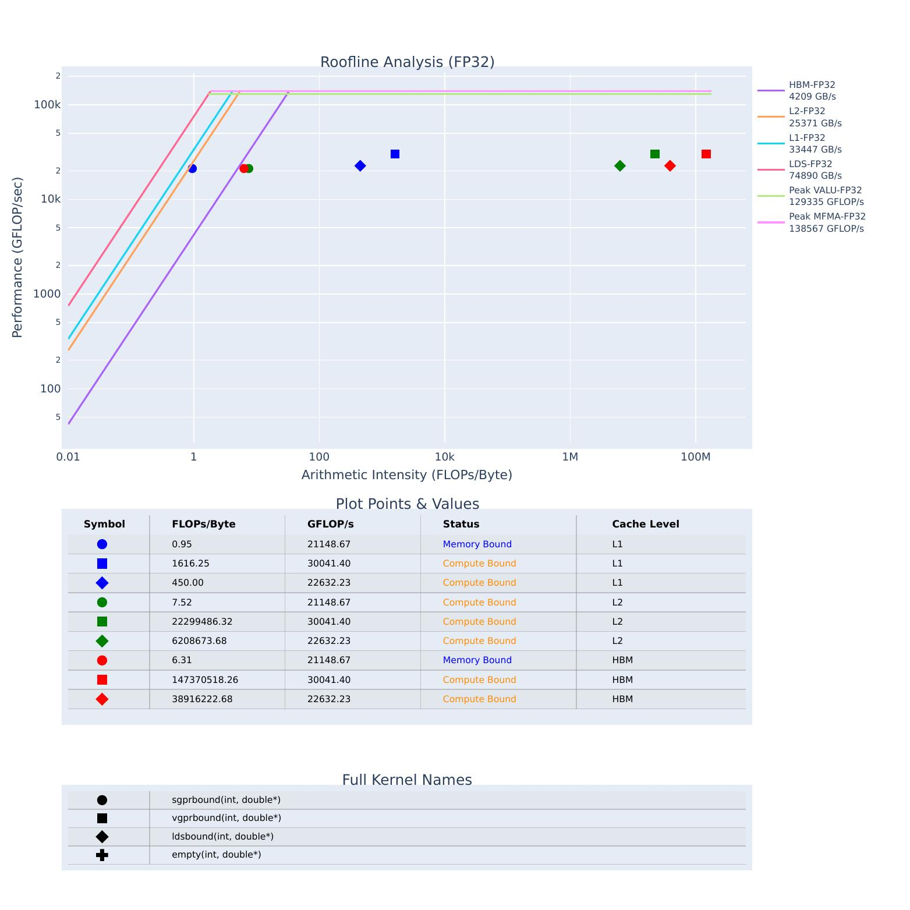

.. meta::
   :description: How to use ROCm Compute Profiler's profile mode
   :keywords: ROCm Compute Profiler, ROCm, profiler, tool, Instinct, accelerator, AMD,
              profiling, profile mode

************
Profile mode
************

The following chapter walks you through ROCm Compute Profiler's core profiling features by
example.

Learn about analysis with ROCm Compute Profiler in :doc:`../analyze/mode`. For an overview of
ROCm Compute Profiler's other modes, see :ref:`modes`.

Profiling
=========

Use the ``rocprof-compute`` executable to acquire all necessary performance monitoring
data through analysis of compute workloads.

Profiling with ROCm Compute Profiler yields the following benefits.

* :ref:`Automate counter collection <profiling-routine>`: ROCm Compute Profiler handles all
  of your profiling via pre-configured input files.

* :ref:`Profiling output format <profiling-output-format>`: ROCm Compute Profile can adjust the
  output format of underlying rocprof tool which changes the output format of raw performance
  counter data in the workload folder created during profiling. Supported output formats are
  ``csv`` and ``rocpd``. The default output format is ``csv``.

.. note::

   The default output format will be changed to ``rocpd`` in a future release of ROCm Compute Profiler.

* :ref:`Filtering <filtering>`: Apply runtime filters to speed up the profiling
  process.

* :ref:`Standalone roofline <standalone-roofline>`: Isolate a subset of built-in
  metrics or build your own profiling configuration.

* :ref:`Iteration multiplexing <iteration-multiplexing>`: Collect a large number of
  performance counters with minimal profiling overhead.

Run ``rocprof-compute profile -h`` for more details. See
:ref:`Basic usage <modes-profile>`.

.. _profile-example:

Profiling example
-----------------

The `<https://github.com/ROCm/rocm-systems/blob/develop/projects/rocprofiler-compute/sample/vcopy.cpp>`__ repository
includes source code for a sample GPU compute workload, ``vcopy.cpp``. A copy of
this file is available in the ``share/sample`` subdirectory after a normal
ROCm Compute Profiler installation, or via the ``$ROCPROFCOMPUTE_SHARE/sample`` directory when
using the supplied modulefile.

The examples in this section use a compiled version of the ``vcopy`` workload to
demonstrate the use of ROCm Compute Profiler in MI accelerator performance analysis. Unless
otherwise noted, the performance analysis is done on the
:ref:`MI200 platform <def-soc>`.

Workload compilation
^^^^^^^^^^^^^^^^^^^^

The following example demonstrates compilation of ``vcopy``.

.. code-block:: shell-session

   $ hipcc vcopy.cpp -o vcopy
   $ ls
   vcopy   vcopy.cpp
   $ ./vcopy -n 1048576 -b 256
   vcopy testing on GCD 0
   Finished allocating vectors on the CPU
   Finished allocating vectors on the GPU
   Finished copying vectors to the GPU
   sw thinks it moved 1.000000 KB per wave
   Total threads: 1048576, Grid Size: 4096 block Size:256, Wavefronts:16384:
   Launching the  kernel on the GPU
   Finished executing kernel
   Finished copying the output vector from the GPU to the CPU
   Releasing GPU memory
   Releasing CPU memory

The following sample command profiles the ``vcopy`` workload.

.. code-block:: shell-session

   $ rocprof-compute profile --name vcopy -- ./vcopy -n 1048576 -b 256

                                    __                                       _
    _ __ ___   ___ _ __  _ __ ___  / _|       ___ ___  _ __ ___  _ __  _   _| |_ ___
   | '__/ _ \ / __| '_ \| '__/ _ \| |_ _____ / __/ _ \| '_ ` _ \| '_ \| | | | __/ _ \
   | | | (_) | (__| |_) | | | (_) |  _|_____| (_| (_) | | | | | | |_) | |_| | ||  __/
   |_|  \___/ \___| .__/|_|  \___/|_|        \___\___/|_| |_| |_| .__/ \__,_|\__\___|
                  |_|                                           |_|

   rocprofiler-compute version: 2.0.0
   Profiler choice: rocprofv1
   Path: /home/auser/repos/rocprofiler-compute/sample/workloads/vcopy/MI200
   Target: MI200
   Command: ./vcopy -n 1048576 -b 256
   Kernel Selection: None
   Dispatch Selection: None
   Hardware Blocks: All

   ~~~~~~~~~~~~~~~~~~~~~~~~~~~~~~~~
   Collecting Performance Counters
   ~~~~~~~~~~~~~~~~~~~~~~~~~~~~~~~~

   [profiling] Current input file: /home/auser/repos/rocprofiler-compute/sample/workloads/vcopy/MI200/perfmon/SQ_IFETCH_LEVEL.txt
      |-> [rocprof] RPL: on '240312_174329' from '/opt/rocm-5.2.1' in '/home/auser/repos/rocprofiler-compute/src/rocprof-compute'
      |-> [rocprof] RPL: profiling '""./vcopy -n 1048576 -b 256""'
      |-> [rocprof] RPL: input file '/home/auser/repos/rocprofiler-compute/sample/workloads/vcopy/MI200/perfmon/SQ_IFETCH_LEVEL.txt'
      |-> [rocprof] RPL: output dir '/tmp/rpl_data_240312_174329_692890'
      |-> [rocprof] RPL: result dir '/tmp/rpl_data_240312_174329_692890/input0_results_240312_174329'
      |-> [rocprof] ROCProfiler: input from "/tmp/rpl_data_240312_174329_692890/input0.xml"
      |-> [rocprof] gpu_index =
      |-> [rocprof] kernel =
      |-> [rocprof] range =
      |-> [rocprof] 6 metrics
      |-> [rocprof] GRBM_COUNT, GRBM_GUI_ACTIVE, SQ_WAVES, SQ_IFETCH, SQ_IFETCH_LEVEL, SQ_ACCUM_PREV_HIRES
      |-> [rocprof] vcopy testing on GCD 0
      |-> [rocprof] Finished allocating vectors on the CPU
      |-> [rocprof] Finished allocating vectors on the GPU
      |-> [rocprof] Finished copying vectors to the GPU
      |-> [rocprof] sw thinks it moved 1.000000 KB per wave
      |-> [rocprof] Total threads: 1048576, Grid Size: 4096 block Size:256, Wavefronts:16384:
      |-> [rocprof] Launching the  kernel on the GPU
      |-> [rocprof] Finished executing kernel
      |-> [rocprof] Finished copying the output vector from the GPU to the CPU
      |-> [rocprof] Releasing GPU memory
      |-> [rocprof] Releasing CPU memory
      |-> [rocprof]
     |-> [rocprof] ROCPRofiler: 1 contexts collected, output directory /tmp/rpl_data_240312_174329_692890/input0_results_240312_174329
       |-> [rocprof] File '/home/auser/repos/rocprofiler-compute/sample/workloads/vcopy/MI200/SQ_IFETCH_LEVEL.csv' is generating
      |-> [rocprof]
   [profiling] Current input file: /home/auser/repos/rocprofiler-compute/sample/workloads/vcopy/MI200/perfmon/SQ_INST_LEVEL_LDS.txt

   ...

   [roofline] Checking for roofline.csv in /home/auser/repos/rocprofiler-compute/sample/workloads/vcopy/MI200
   [roofline] No roofline data found. Generating...
   Empirical Roofline Calculation
   Copyright © 2022  Advanced Micro Devices, Inc. All rights reserved.
   Total detected GPU devices: 4
   GPU Device 0: Profiling...
    99% [||||||||||||||||||||||||||||||||||||||||||||||||||||||||||| ]
  HBM BW, GPU ID: 0, workgroupSize:256, workgroups:2097152, experiments:100, traffic:8589934592 bytes, duration:6.2 ms, mean:1388.0 GB/sec, stdev=3.1 GB/sec
     99% [||||||||||||||||||||||||||||||||||||||||||||||||||||||||||| ]
  L2 BW, GPU ID: 0, workgroupSize:256, workgroups:8192, experiments:100, traffic:687194767360 bytes, duration:136.5 ms, mean:5020.8 GB/sec, stdev=16.5 GB/sec
     99% [||||||||||||||||||||||||||||||||||||||||||||||||||||||||||| ]
  L1 BW, GPU ID: 0, workgroupSize:256, workgroups:16384, experiments:100, traffic:26843545600 bytes, duration:2.9 ms, mean:9229.5 GB/sec, stdev=2.9 GB/sec
     99% [||||||||||||||||||||||||||||||||||||||||||||||||||||||||||| ]
   LDS BW, GPU ID: 0, workgroupSize:256, workgroups:16384, experiments:100, traffic:33554432000 bytes, duration:1.9 ms, mean:17645.6 GB/sec, stdev=20.1 GB/sec
    99% [||||||||||||||||||||||||||||||||||||||||||||||||||||||||||| ]
   Peak FLOPs (FP32), GPU ID: 0, workgroupSize:256, workgroups:16384, experiments:100, FLOP:274877906944, duration:13.078 ms, mean:20986.9 GFLOPS, stdev=310.8 GFLOPS
    99% [||||||||||||||||||||||||||||||||||||||||||||||||||||||||||| ]
   Peak FLOPs (FP64), GPU ID: 0, workgroupSize:256, workgroups:16384, experiments:100, FLOP:137438953472, duration:6.7 ms, mean:20408.029297.1 GFLOPS, stdev=2.7 GFLOPS
    99% [||||||||||||||||||||||||||||||||||||||||||||||||||||||||||| ]
   Peak MFMA FLOPs (BF16), GPU ID: 0, workgroupSize:256, workgroups:16384, experiments:100, FLOP:2147483648000, duration:12.6 ms, mean:170280.0 GFLOPS, stdev=22.3 GFLOPS
    99% [||||||||||||||||||||||||||||||||||||||||||||||||||||||||||| ]
   Peak MFMA FLOPs (F16), GPU ID: 0, workgroupSize:256, workgroups:16384, experiments:100, FLOP:2147483648000, duration:13.0 ms, mean:164733.6 GFLOPS, stdev=24.3 GFLOPS
    99% [||||||||||||||||||||||||||||||||||||||||||||||||||||||||||| ]
   Peak MFMA FLOPs (F32), GPU ID: 0, workgroupSize:256, workgroups:16384, experiments:100, FLOP:536870912000, duration:13.0 ms, mean:41399.6 GFLOPS, stdev=4.1 GFLOPS
    99% [||||||||||||||||||||||||||||||||||||||||||||||||||||||||||| ]
   Peak MFMA FLOPs (F64), GPU ID: 0, workgroupSize:256, workgroups:16384, experiments:100, FLOP:268435456000, duration:6.5 ms, mean:41379.2 GFLOPS, stdev=4.4 GFLOPS
    99% [||||||||||||||||||||||||||||||||||||||||||||||||||||||||||| ]
   Peak MFMA IOPs (I8), GPU ID: 0, workgroupSize:256, workgroups:16384, experiments:100, IOP:2147483648000, duration:12.9 ms, mean:166281.9 GOPS, stdev=2495.9 GOPS
   GPU Device 1: Profiling...
   ...
   GPU Device 2: Profiling...
   ...
   GPU Device 3: Profiling...
   ...

.. tip::

   To reduce verbosity of profiling output try the ``--quiet`` flag. This hides
   ``rocprof`` output and activates a progress bar.

.. _profiling-routine:

Notice the two main stages in ROCm Compute Profiler's *default* profiling routine.

1. The first stage collects all the counters needed for ROCm Compute Profiler analysis
   (omitting any filters you have provided).

2. The second stage collects data for the roofline analysis (this stage can be
   disabled using ``--no-roof``).

At the end of profiling, you can find all resulting ``csv`` files in a
:ref:`SoC <def-soc>`-specific target directory; for
example:

* "MI300A" or "MI300X" for the AMD Instinct™ MI300 family of accelerators
* "MI200" for the AMD Instinct MI200 family of accelerators
* "MI100" for the AMD Instinct MI100 family of accelerators

The SoC names are generated as a part of ROCm Compute Profiler, and do not *always*
distinguish between different accelerators in the same family; for instance,
an Instinct MI210 vs an Instinct MI250.

.. note::

   Additionally, you will notice a few extra files. An SoC parameters file,
   ``sysinfo.csv``, is created to reflect the target device settings. All
   profiling output is stored in ``log.txt``. Roofline-specific benchmark
   results are stored in ``roofline.csv`` and roofline plots are outputted into HTMLs as
   ``empirRoof_gpu-0_[datatype1]_..._[datatypeN].html`` where data types requested through
   ``--roofline-data-type`` option are listed in the file name.

.. code-block:: shell-session

   $ ls workloads/vcopy/MI200/
   total 112
   total 60
   -rw-r--r-- 1 auser agroup 27937 Mar  1 15:15 log.txt
   drwxr-xr-x 1 auser agroup     0 Mar  1 15:15 perfmon
   -rw-r--r-- 1 auser agroup 26175 Mar  1 15:15 pmc_perf.csv
   -rw-r--r-- 1 auser agroup  1708 Mar  1 15:17 roofline.csv
   -rw-r--r-- 1 auser agroup   519 Mar  1 15:15 SQ_IFETCH_LEVEL.csv
   -rw-r--r-- 1 auser agroup   456 Mar  1 15:15 SQ_INST_LEVEL_LDS.csv
   -rw-r--r-- 1 auser agroup   474 Mar  1 15:15 SQ_INST_LEVEL_SMEM.csv
   -rw-r--r-- 1 auser agroup   474 Mar  1 15:15 SQ_INST_LEVEL_VMEM.csv
   -rw-r--r-- 1 auser agroup   599 Mar  1 15:15 SQ_LEVEL_WAVES.csv
   -rw-r--r-- 1 auser agroup   650 Mar  1 15:15 sysinfo.csv
   -rw-r--r-- 1 auser agroup   399 Mar  1 15:15 timestamps.csv

Output directory configuration
------------------------------

Profile mode writes results into a workload directory. By default, the output
directory is derived from ``--name`` and the target system information:

* Without MPI rank detection, the default is ``./workloads/<name>/<gpu_model>``.
* With MPI rank detection, the default is ``./workloads/<name>/<rank>``.

You can override the output directory with ``--output-directory``. The
``--path`` (``-p``) argument is deprecated for profile mode. When ``--output-directory`` is
explicitly provided, ``--name`` is ignored.

.. note::

   ``--path`` and ``--subpath`` are deprecated for profile mode and will be
   removed in a future release. Use ``--output-directory`` with parameterized
   placeholders instead.

The output directory can be parameterized with the following keywords:

* ``%hostname%``: Host name
* ``%gpumodel%``: GPU model
* ``%rank%``: MPI process rank (ignored with a warning if no rank is detected)
* ``%env{NAME}%``: Environment variable ``NAME`` (empty string if unset)

If MPI rank is detected and the output directory does not include ``%rank%``,
ROCm Compute Profiler appends ``/<rank>`` to avoid collisions across ranks.

Examples:

* Profiling without MPI:

.. code-block:: shell-session

   $ rocprof-compute profile --name vcopy -- ./vcopy -n 1048576 -b 256

   $ tree workloads/vcopy

   └── MI200
    ├── empirRoof_gpu-0_FP32.html
    ├── log.txt
    ├── perfmon
    │   ├── pmc_perf_0.txt
    │   ├── pmc_perf_0.yaml
    │   ├── pmc_perf_1.txt
    │   ├── pmc_perf_1.yaml
    │   ├── pmc_perf_2.txt
    │   ├── pmc_perf_2.yaml
    │   ├── pmc_perf_3.txt
    │   ├── pmc_perf_3.yaml
    │   ├── pmc_perf_4.txt
    │   ├── pmc_perf_4.yaml
    │   ├── pmc_perf_5.txt
    │   ├── SQC_DCACHE_INFLIGHT_LEVEL.txt
    │   ├── SQC_DCACHE_INFLIGHT_LEVEL.yaml
    │   ├── SQC_ICACHE_INFLIGHT_LEVEL.txt
    │   ├── SQC_ICACHE_INFLIGHT_LEVEL.yaml
    │   ├── SQ_IFETCH_LEVEL.txt
    │   ├── SQ_IFETCH_LEVEL.yaml
    │   ├── SQ_INST_LEVEL_LDS.txt
    │   ├── SQ_INST_LEVEL_LDS.yaml
    │   ├── SQ_INST_LEVEL_SMEM.txt
    │   ├── SQ_INST_LEVEL_SMEM.yaml
    │   ├── SQ_INST_LEVEL_VMEM.txt
    │   ├── SQ_INST_LEVEL_VMEM.yaml
    │   ├── SQ_LEVEL_WAVES.txt
    │   └── SQ_LEVEL_WAVES.yaml
    ├── pmc_perf.csv
    ├── profiling_config.yaml
    ├── roofline.csv
    └── sysinfo.csv

* Profiling with MPI at host ``amd-ryzen``:

.. code-block:: shell-session

   $ mpirun -n 4 rocprof-compute profile --output-directory /tmp/profiles/%hostname%/%rank% -- ./vcopy -n 1048576 -b 256

   $ tree /tmp/profiles/amd-ryzen/0

   └── MI200
    ├── empirRoof_gpu-0_FP32.html
    ├── log.txt
    ├── perfmon
    │   ├── pmc_perf_0.txt
    │   ├── pmc_perf_0.yaml
    │   ├── pmc_perf_1.txt
    │   ├── pmc_perf_1.yaml
    │   ├── pmc_perf_2.txt
    │   ├── pmc_perf_2.yaml
    │   ├── pmc_perf_3.txt
    │   ├── pmc_perf_3.yaml
    │   ├── pmc_perf_4.txt
    │   ├── pmc_perf_4.yaml
    │   ├── pmc_perf_5.txt
    │   ├── SQC_DCACHE_INFLIGHT_LEVEL.txt
    │   ├── SQC_DCACHE_INFLIGHT_LEVEL.yaml
    │   ├── SQC_ICACHE_INFLIGHT_LEVEL.txt
    │   ├── SQC_ICACHE_INFLIGHT_LEVEL.yaml
    │   ├── SQ_IFETCH_LEVEL.txt
    │   ├── SQ_IFETCH_LEVEL.yaml
    │   ├── SQ_INST_LEVEL_LDS.txt
    │   ├── SQ_INST_LEVEL_LDS.yaml
    │   ├── SQ_INST_LEVEL_SMEM.txt
    │   ├── SQ_INST_LEVEL_SMEM.yaml
    │   ├── SQ_INST_LEVEL_VMEM.txt
    │   ├── SQ_INST_LEVEL_VMEM.yaml
    │   ├── SQ_LEVEL_WAVES.txt
    │   └── SQ_LEVEL_WAVES.yaml
    ├── pmc_perf.csv
    ├── profiling_config.yaml
    ├── roofline.csv
    └── sysinfo.csv

.. _profiling-output-format:

Profiling output format
-----------------------

Use the ``--format-rocprof-output <format>`` profile mode option to specify the output format
of the underlying ``rocprof`` tool. The following formats are supported:

* ``csv`` format:
   * Ask underlying rocprof tool to dump raw performance counter data in csv format.
   * The generated csv files across multiple runs of rocprof are processed and dumped into the workload directory as csv files.
   * Multiple csv files are merged into single pmc_perf.csv file in workload directory.

* ``rocpd`` format:
   * Ask underlying rocprof tool to dump raw performance counter data in rocpd format.
   * Multiple ``rocpd`` database files containding counter collection data are merged into a single csv under the workload folder.
     The database files are then removed.
   * Use ``--retain-rocpd-output`` profile mode option to preserve the ``rocpd`` database(s) in the workload folder.
     This is useful for custom analysis of profiling data.

.. _filtering:

Filtering
=========

To reduce profiling time and the counters collected, you should use profiling
filters. Profiling filters and their functionality depend on the underlying
profiler being used. While ROCm Compute Profiler is profiler-agnostic, this following is a
detailed description of profiling filters available when using ROCm Compute Profiler with
:doc:`ROCProfiler <rocprofiler:index>`.

Filtering options
-----------------

``-b``, ``--block <block-id|block-alias|metric-id>``
   Allows system profiling on one or more selected analysis report blocks to speed
   up the profiling process. See :ref:`profiling-hw-component-filtering`.
   Note that this option cannot be used with ``--roof-only`` or ``--set``.

``-k``, ``--kernel <kernel-substr>``
   Allows for kernel filtering. Usage is equivalent with the current ``rocprof``
   utility. See :ref:`profiling-kernel-filtering`.

``-d``, ``--dispatch <dispatch-id>``
   Allows for dispatch iteration filtering. Usage is equivalent with the current
   ``rocprof`` utility. See :ref:`profiling-dispatch-filtering`.

``--set <metric-set>``
   Allows for single pass counter collection of sets of metrics with minimized profiling overhead.
   Cannot be used with ``--roof-only`` or ``--block``.
   See :ref:`profiling-metric-sets`.

.. tip::

   Be cautious when combining different profiling filters in the same call.
   Conflicting filters may result in error.

   For example, filtering a dispatch, but that dispatch doesn't match your
   kernel name filter.

.. _profiling-hw-component-filtering:

Analysis report block filtering
^^^^^^^^^^^^^^^^^^^^^^^^^^^^^^^^

You can profile specific hardware report blocks to speed up the profiling process.
In ROCm Compute Profiler, the term analysis report block refers to a section of the
analysis report which focuses on metrics associated with a hardware component or
a group of hardware components. All profiling results are accumulated in the same
target directory without overwriting those for other hardware components.
This enables incremental profiling and analysis.

The following example only gathers hardware counters used to calculate metrics
for ``Compute Unit - Instruction Mix`` (block 10) and ``Wavefront Launch Statistics``
(block 7) sections of the analysis report, while skipping over all other hardware counters.

.. code-block:: shell-session

   $ rocprof-compute profile --name vcopy -b 10 7 -- ./vcopy -n 1048576 -b 256

                                    __                                       _
    _ __ ___   ___ _ __  _ __ ___  / _|       ___ ___  _ __ ___  _ __  _   _| |_ ___
   | '__/ _ \ / __| '_ \| '__/ _ \| |_ _____ / __/ _ \| '_ ` _ \| '_ \| | | | __/ _ \
   | | | (_) | (__| |_) | | | (_) |  _|_____| (_| (_) | | | | | | |_) | |_| | ||  __/
   |_|  \___/ \___| .__/|_|  \___/|_|        \___\___/|_| |_| |_| .__/ \__,_|\__\___|
                  |_|                                           |_|

   rocprofiler-compute version: 2.0.0
   Profiler choice: rocprofv1
   Path: /home/auser/repos/rocprofiler-compute/sample/workloads/vcopy/MI200
   Target: MI200
   Command: ./vcopy -n 1048576 -b 256
   Kernel Selection: None
   Dispatch Selection: None
   Hardware Blocks: []
   Report Sections: ['10', '7']

   ~~~~~~~~~~~~~~~~~~~~~~~~~~~~~~~~
   Collecting Performance Counters
   ~~~~~~~~~~~~~~~~~~~~~~~~~~~~~~~~
   ...

It is also possible to collect individual metrics from the analysis report by providing metric ids.
The following example only collects the counters required to calculate ``Total VALU FLOPs`` (metric id 11.1.0) and ``LDS Utilization`` (metric id 12.1.0).

.. code-block:: shell-session

   $ rocprof-compute profile --name vcopy -b 11.1.1 12.1.1 -- ./vcopy -n 1048576 -b 256

                                    __                                       _
    _ __ ___   ___ _ __  _ __ ___  / _|       ___ ___  _ __ ___  _ __  _   _| |_ ___
   | '__/ _ \ / __| '_ \| '__/ _ \| |_ _____ / __/ _ \| '_ ` _ \| '_ \| | | | __/ _ \
   | | | (_) | (__| |_) | | | (_) |  _|_____| (_| (_) | | | | | | |_) | |_| | ||  __/
   |_|  \___/ \___| .__/|_|  \___/|_|        \___\___/|_| |_| |_| .__/ \__,_|\__\___|
                  |_|                                           |_|

   rocprofiler-compute version: 2.0.0
   Profiler choice: rocprofv1
   Path: /home/auser/repos/rocprofiler-compute/sample/workloads/vcopy/MI200
   Target: MI200
   Command: ./vcopy -n 1048576 -b 256
   Kernel Selection: None
   Dispatch Selection: None
   Hardware Blocks: []
   Report Sections: ['11.1.0', '12.1.0']

   ~~~~~~~~~~~~~~~~~~~~~~~~~~~~~~~~
   Collecting Performance Counters
   ~~~~~~~~~~~~~~~~~~~~~~~~~~~~~~~~
   ...

To see a list of available hardware report blocks, use the ``--list-available-metrics`` option.

.. code-block:: shell-session

   $ rocprof-compute profile --list-available-metrics

                                    __                                       _
    _ __ ___   ___ _ __  _ __ ___  / _|       ___ ___  _ __ ___  _ __  _   _| |_ ___
   | '__/ _ \ / __| '_ \| '__/ _ \| |_ _____ / __/ _ \| '_ ` _ \| '_ \| | | | __/ _ \
   | | | (_) | (__| |_) | | | (_) |  _|_____| (_| (_) | | | | | | |_) | |_| | ||  __/
   |_|  \___/ \___| .__/|_|  \___/|_|        \___\___/|_| |_| |_| .__/ \__,_|\__\___|
                  |_|                                           |_|

   0 -> Top Stats
   1 -> System Info
   2 -> System Speed-of-Light
         2.1 -> Speed-of-Light
                  2.1.0 -> VALU FLOPs
                  2.1.1 -> VALU IOPs
                  2.1.2 -> MFMA FLOPs (F8)
   ...
   5 -> Command Processor (CPC/CPF)
         5.1 -> Command Processor Fetcher
                  5.1.0 -> CPF Utilization
                  5.1.1 -> CPF Stall
                  5.1.2 -> CPF-L2 Utilization
         5.2 -> Packet Processor
                  5.2.0 -> CPC Utilization
                  5.2.1 -> CPC Stall Rate
                  5.2.5 -> CPC-UTCL1 Stall
   ...
   6 -> Workgroup Manager (SPI)
         6.1 -> Workgroup Manager Utilizations
                  6.1.0 -> Accelerator Utilization
                  6.1.1 -> Scheduler-Pipe Utilization
                  6.1.2 -> Workgroup Manager Utilization

.. _profiling-kernel-filtering:

Kernel filtering
^^^^^^^^^^^^^^^^

Kernel filtering is based on the name of the kernels you want to isolate. Use a
kernel name substring list to isolate desired kernels.

The following example demonstrates profiling isolating the kernel matching
substring ``vecCopy``.

.. code-block:: shell-session

   $ rocprof-compute profile --name vcopy -k vecCopy -- ./vcopy -n 1048576 -b 256

                                    __                                       _
    _ __ ___   ___ _ __  _ __ ___  / _|       ___ ___  _ __ ___  _ __  _   _| |_ ___
   | '__/ _ \ / __| '_ \| '__/ _ \| |_ _____ / __/ _ \| '_ ` _ \| '_ \| | | | __/ _ \
   | | | (_) | (__| |_) | | | (_) |  _|_____| (_| (_) | | | | | | |_) | |_| | ||  __/
   |_|  \___/ \___| .__/|_|  \___/|_|        \___\___/|_| |_| |_| .__/ \__,_|\__\___|
                  |_|                                           |_|

   rocprofiler-compute version: 2.0.0
   Profiler choice: rocprofv1
   Path: /home/auser/repos/rocprofiler-compute/sample/workloads/vcopy/MI200
   Target: MI200
   Command: ./vcopy -n 1048576 -b 256
   Kernel Selection: ['vecCopy']
   Dispatch Selection: None
   Hardware Blocks: All

   ~~~~~~~~~~~~~~~~~~~~~~~~~~~~~~~~
   Collecting Performance Counters
   ~~~~~~~~~~~~~~~~~~~~~~~~~~~~~~~~
   ...

.. _profiling-dispatch-filtering:

Dispatch filtering
^^^^^^^^^^^^^^^^^^

Dispatch filtering is based on the *global* dispatch index of kernels in a run.

The following example profiles only the first kernel dispatch in the execution
of the application (note zero-based indexing).

.. code-block:: shell-session

   $ rocprof-compute profile --name vcopy -d 0 -- ./vcopy -n 1048576 -b 256

                                    __                                       _
    _ __ ___   ___ _ __  _ __ ___  / _|       ___ ___  _ __ ___  _ __  _   _| |_ ___
   | '__/ _ \ / __| '_ \| '__/ _ \| |_ _____ / __/ _ \| '_ ` _ \| '_ \| | | | __/ _ \
   | | | (_) | (__| |_) | | | (_) |  _|_____| (_| (_) | | | | | | |_) | |_| | ||  __/
   |_|  \___/ \___| .__/|_|  \___/|_|        \___\___/|_| |_| |_| .__/ \__,_|\__\___|
                  |_|                                           |_|

   rocprofiler-compute version: 2.0.0
   Profiler choice: rocprofv1
   Path: /home/auser/repos/rocprofiler-compute/sample/workloads/vcopy/MI200
   Target: MI200
   Command: ./vcopy -n 1048576 -b 256
   Kernel Selection: None
   Dispatch Selection: ['0']
   Hardware Blocks: All

   ~~~~~~~~~~~~~~~~~~~~~~~~~~~~~~~~
   Collecting Performance Counters
   ~~~~~~~~~~~~~~~~~~~~~~~~~~~~~~~~
   ...

.. _profiling-metric-sets:

Metric sets filtering
^^^^^^^^^^^^^^^^^^^^^^^

A metrics set contains a subset of metrics that can be collected in a single pass. This filtering option minimizes profiling overhead by only collecting counters of interest.
The `--set` filter option provides a convenient way to group related metrics for common profiling scenarios, eliminating the need to manually specify individual metrics for typical analysis workflows.
This option cannot be used with ``--roof-only`` and ``--block``.

.. code-block:: shell-session

   $ rocprof-compute profile --name vcopy --set compute_thruput_util -- ./vcopy -n 1048576 -b 256

                                    __                                       _
    _ __ ___   ___ _ __  _ __ ___  / _|       ___ ___  _ __ ___  _ __  _   _| |_ ___
   | '__/ _ \ / __| '_ \| '__/ _ \| |_ _____ / __/ _ \| '_ ` _ \| '_ \| | | | __/ _ \
   | | | (_) | (__| |_) | | | (_) |  _|_____| (_| (_) | | | | | | |_) | |_| | ||  __/
   |_|  \___/ \___| .__/|_|  \___/|_|        \___\___/|_| |_| |_| .__/ \__,_|\__\___|
                  |_|                                           |_|

   rocprofiler-compute version: 2.0.0
   Profiler choice: rocprofv1
   Path: /home/auser/repos/rocprofiler-compute/sample/workloads/vcopy/MI200
   Target: MI200
   Command: ./vcopy -n 1048576 -b 256
   Kernel Selection: None
   Dispatch Selection: ['0']
   Set Selection: compute_thruput_util
   Report Sections: ['11.2.3', '11.2.4', '11.2.6', '11.2.7', '11.2.9']

   ~~~~~~~~~~~~~~~~~~~~~~~~~~~~~~~~
   Collecting Performance Counters
   ~~~~~~~~~~~~~~~~~~~~~~~~~~~~~~~~
   ...

To see a list of available sets, use the ``--list-sets`` option.

.. code-block:: shell-session

   $ rocprof-compute profile --list-sets

                                    __                                       _
    _ __ ___   ___ _ __  _ __ ___  / _|       ___ ___  _ __ ___  _ __  _   _| |_ ___
   | '__/ _ \ / __| '_ \| '__/ _ \| |_ _____ / __/ _ \| '_ ` _ \| '_ \| | | | __/ _ \
   | | | (_) | (__| |_) | | | (_) |  _|_____| (_| (_) | | | | | | |_) | |_| | ||  __/
   |_|  \___/ \___| .__/|_|  \___/|_|        \___\___/|_| |_| |_| .__/ \__,_|\__\___|
                  |_|                                           |_|

   Available Sets:
   ===================================================================================================================
   Set Option                          Set Title                           Metric Name                    Metric ID
   -------------------------------------------------------------------------------------------------------------------
   compute_thruput_util                Compute Throughput Utilization      SALU Utilization               11.2.3
                                                                           VALU Utilization               11.2.4
                                                                           VMEM Utilization               11.2.6
                                                                           Branch Utilization             11.2.7

   ...

   launch_stats                        Launch Stats                        Grid Size                      7.1.0
                                                                           Workgroup Size                 7.1.1
                                                                           Total Wavefronts               7.1.2
                                                                           VGPRs                          7.1.5
                                                                           AGPRs                          7.1.6
                                                                           SGPRs                          7.1.7
                                                                           LDS Allocation                 7.1.8
                                                                           Scratch Allocation             7.1.9

   Usage Examples:
   rocprof-compute profile --set compute_thruput_util  # Profile this set
   rocprof-compute profile --list-sets        # Show this help

.. _standalone-roofline:

Standalone roofline
===================

Roofline analysis occurs on any profile mode run, provided ``--no-roof`` option is not included.
You don't need to include any additional roofline-specific options for roofline analysis.
If you want to focus only on roofline-specific performance data and reduce the time it takes to profile, you can use the ``--roof-only`` option.
This option checks if there is existing profiling data in the workload directory (``pmc_perf.csv`` and ``roofline.csv``):

   a) If found, uses the data files with the provided arguments to create another roofline HTML output; otherwise,
	
   b) Profile mode runs but is limited to collecting only roofline performance counters.

Note that ``--roof-only`` cannot be used with ``--block`` or ``--set`` options.

Roofline options
----------------

``--sort <desired_sort>``
   Allows you to specify whether you would like to overlay top kernel or top
   dispatch data in your roofline plot.

``-m``, ``--mem-level <cache_level>``
   Allows you to specify specific levels of cache to include in your roofline
   plot.

``--device <gpu_id>``
   Allows you to specify a device ID to collect performance data from when
   running a roofline benchmark on your system.

``-k``, ``--kernel <kernel-substr>``
   Allows for kernel filtering. Usage is equivalent with the current ``rocprof``
   utility. See :ref:`profiling-kernel-filtering`.

``--roofline-data-type <datatype>``
   Allows you to specify data types that you want plotted in the roofline HTML output(s). Selecting more than one data type will overlay the results onto the same plot. Default: FP32

.. note::

  For more information on data types supported based on the GPU architecture, see :doc:`../../conceptual/performance-model`

Each kernel in your ``.html`` roofline plot is automatically distinguished with a unique marker identifiable from the plot's key. The roofline HTML includes an integrated multi-subplot layout with:

1. **Roofline Plot** - Shows performance ceilings and kernel arithmetic intensity points
2. **Plot Points & Values Table** - Displays AI values, performance metrics, memory/compute bound status, and cache levels for each kernel
3. **Full Kernel Names Table** - Lists complete kernel names with their corresponding plot markers

Roofline only
-------------

The following example demonstrates profiling roofline data only:

.. code-block:: shell-session

   $ rocprof-compute profile --name occupancy --roof-only -- ./tests/occupancy -n 1048576 -b 256
                                    __                                       _
   _ __ ___   ___ _ __  _ __ ___  / _|       ___ ___  _ __ ___  _ __  _   _| |_ ___
   | '__/ _ \ / __| '_ \| '__/ _ \| |_ _____ / __/ _ \| '_ ` _ \| '_ \| | | | __/ _ \
   | | | (_) | (__| |_) | | | (_) |  _|_____| (_| (_) | | | | | | |_) | |_| | ||  __/
   |_|  \___/ \___| .__/|_|  \___/|_|        \___\___/|_| |_| |_| .__/ \__,_|\__\___|
                  |_|                                           |_|
   ...
   INFO [roofline] Generating pmc_perf.csv (roofline counters only).
   INFO Rocprofiler-Compute version: 3.3.0
   INFO Profiler choice: rocprofiler-sdk
   INFO Path: /app/projects/rocprofiler-compute/workloads/occupancy/MI300X_A1
   INFO Target: MI300X_A1
   INFO Command: ./tests/occupancy -n 1048576 -b 256
   INFO Kernel Selection: None
   INFO Dispatch Selection: None
   INFO Filtered sections: ['4']
   INFO
   INFO ~~~~~~~~~~~~~~~~~~~~~~~~~~~~~~~~~~~~~~~~~~~~~~~~
   INFO Collecting Performance Counters (Roofline Only)
   INFO ~~~~~~~~~~~~~~~~~~~~~~~~~~~~~~~~~~~~~~~~~~~~~~~~
   INFO
   INFO [Run 1/3][Approximate profiling time left: pending first measurement...]
   INFO [profiling] Current input file: /app/projects/rocprofiler-compute/workloads/occupancy/MI300X_A1/perfmon/pmc_perf_0.txt
   ...
   INFO [roofline] Checking for roofline.csv in /app/projects/rocprofiler-compute/workloads/occupancy/MI300X_A1
   INFO [roofline] No roofline data found. Generating...
   Empirical Roofline Calculation
   Copyright © 2025  Advanced Micro Devices, Inc. All rights reserved.
   Total detected GPU devices: 8
   GPU Device 0 (gfx942) with 304 CUs: Profiling...
   99% [||||||||||||||||||||||||||||||||||||||||||||||||||||||||||| ]
   ...

An inspection of our workload output folder shows ``.html`` plots were generated
successfully.

.. code-block:: shell-session

   $ ls workloads/occupancy/MI300X_A1
   total 48
   -rw-r--r-- 1 auser agroup 13331 Oct 29 10:33 empirRoof_gpu-0_FP32.html
   drwxr-xr-x 1 auser agroup     0 Oct 29 10:33 perfmon
   -rw-r--r-- 1 auser agroup  1101 Oct 29 10:33 pmc_perf.csv
   -rw-r--r-- 1 auser agroup  1715 Oct 29 10:33 roofline.csv
   -rw-r--r-- 1 auser agroup   650 Oct 29 10:33 sysinfo.csv
   -rw-r--r-- 1 auser agroup   399 Oct 29 10:33 timestamps.csv

.. note::

   * ROCm Compute Profiler currently captures roofline profiling for all data types, and you can reduce the clutter in the HTML outputs by filtering the data type(s). Selecting multiple data types will overlay the results into the same HTML. To generate results in separate HTML for each data type from the same workload run, you can re-run the profiling command with each data type as long as the ``roofline.csv`` file still exists in the workload folder.

The following image is a sample ``empirRoof_gpu-0_FP32.html`` roofline
plot.

.. _torch-operator-mapping:

Torch Operator Mapping
========================

To analyze performance metrics at the PyTorch operator level, ROCm Compute Profiler
offers Torch Operator Mapping functionality. This feature maps performance counters
to specific PyTorch operators, enabling detailed performance analysis of
PyTorch workloads at the operator granularity.

When enabled, this feature instruments your PyTorch application to correlate GPU
kernel executions with their originating PyTorch operators, providing insights into
which operators contribute to specific performance counter values.

.. warning::

   Torch trace is an **experimental** feature. You must pass ``--experimental`` to
   both **profile** and **analyze** when using torch-trace-related options
   (``--torch-trace`` for profile; ``--list-torch-operators`` and ``--torch-operator``
   for analyze).

.. note::

   **PyTorch Operators vs GPU Kernels**: PyTorch operators (such as ``conv2d``,
   ``linear``, ``relu``) are high-level API functions. When executed on GPU, these
   operators may dispatch one or more low-level GPU kernels (such as
   ``implicit_convolve_sgemm``) that perform the actual computation on the hardware.
   The ``--torch-trace`` feature provides operator-level attribution by injecting
   markers that map collected kernel performance counters to their originating PyTorch
   operators.

Requirements
------------

* Valid PyTorch installation in the profiling environment
* PyTorch application must be run as a Python script or Python command
* Workload’s Python version must match roctx’s Python version

Usage
-----

To enable Torch operator mapping, use ``--experimental`` with the ``--torch-trace``
option when profiling a PyTorch workload:

.. code-block:: shell-session

   $ rocprof-compute --experimental profile --name mnist_torch --torch-trace -- python train.py

                                    __                                       _
    _ __ ___   ___ _ __  _ __ ___  / _|       ___ ___  _ __ ___  _ __  _   _| |_ ___
   | '__/ _ \ / __| '_ \| '__/ _ \| |_ _____ / __/ _ \| '_ ` _ \| '_ \| | | | __/ _ \
   | | | (_) | (__| |_) | | | (_) |  _|_____| (_| (_) | | | | | | |_) | |_| | ||  __/
   |_|  \___/ \___| .__/|_|  \___/|_|        \___\___/|_| |_| |_| .__/ \__,_|\__\___|
                  |_|                                           |_|

   rocprofiler-compute version: 3.4.0
   Profiler choice: rocprofiler-sdk
   Path: /home/auser/workloads/mnist_torch/MI300X_A1
   Target: MI300X_A1
   Command: python train.py
   Torch Trace: Enabled
   Kernel Selection: None
   Dispatch Selection: None
   Hardware Blocks: All

   ~~~~~~~~~~~~~~~~~~~~~~~~~~~~~~~~
   Collecting Performance Counters
   ~~~~~~~~~~~~~~~~~~~~~~~~~~~~~~~~
   ...

Output
------

When Torch operator mapping is enabled, profiling writes additional CSV files in the
workload directory: **marker_api_trace** and **counter_collection** files with the
``torch_trace`` prefix (e.g. ``torch_trace_<fbase>_marker_api_trace.csv`` and
``torch_trace_<fbase>_counter_collection.csv``). These correlate PyTorch operators
with GPU kernels and performance counters. Analyze mode uses them to build
per-operator CSVs under ``torch_trace/``; the source marker and counter files
are removed after consolidation.

``torch_trace/`` directory
   Contains per-operator CSV files. Columns include:

   * ``Operator_Name`` - Full operator hierarchy (e.g.
     ``nn.Module.Net.forward/nn.Module.Conv2d.forward/torch.nn.functional.relu``,
     ``nn.Module.ResNet.forward/torch.nn.functional.relu``).
   * ``Context_Id`` - Call context (e.g., ``1@__init__.py:231``)
   * ``Counter_Name`` / ``Counter_Value`` - Performance counter values
   * ``Start_Timestamp_function`` / ``End_Timestamp_function`` - Operator timing
   * ``Start_Timestamp_kernel`` / ``End_Timestamp_kernel`` - Kernel timing

   This per-operator organization enables focused analysis of specific operators without
   processing the entire trace.

Sample rows from ``torch_trace/ones_like.csv`` (from profiling an mnist model).

.. list-table::
   :header-rows: 1
   :widths: 16 14 42 22 12 14 14 14 14

   * - Operator_Name
     - Context_Id
     - Kernel_Name
     - Counter_Name
     - Counter_Value
     - Start_Timestamp_function
     - End_Timestamp_function
     - Start_Timestamp_kernel
     - End_Timestamp_kernel

   * - torch.ones_like
     - 1@__init__.py:231
     - ``void at::native::vectorized_elementwise_kernel<...>(...)``
     - CPC_CPC_STAT_BUSY
     - 23004
     - 6789210204040073
     - 6789210223815845
     - 6789210223810274
     - 6789210223811914

   * - torch.ones_like
     - 1@__init__.py:231
     - ``void at::native::vectorized_elementwise_kernel<...>(...)``
     - CPC_CPC_STAT_IDLE
     - 0
     - 6789210204040073
     - 6789210223815845
     - 6789210223810274
     - 6789210223811914

   * - torch.ones_like
     - 1@__init__.py:231
     - ``void at::native::vectorized_elementwise_kernel<...>(...)``
     - CPC_CPC_STAT_STALL
     - 6715
     - 6789281060081123
     - 6789281079930585
     - 6789281079932564
     - 6789281079934204

``pmc_perf.csv``
   Standard performance counter data (same as non-torch profiling)

This data enables analysis such as:

* Identifying which PyTorch operators executed which GPU kernels
* Aggregating performance counter values by operator
* Correlating operator-level timing with kernel-level hardware metrics
* Tracing the execution flow from high-level PyTorch API to low-level GPU kernels

Limitations
-----------

.. warning::

   * Torch trace is experimental: use ``rocprof-compute --experimental profile ...
     --torch-trace`` and ``rocprof-compute --experimental analyze ...`` with
     ``--list-torch-operators`` or ``--torch-operator`` as needed.

   * The ``--torch-trace`` option requires the application to be a Python command
     or Python script.

   * A valid PyTorch installation must be available in the environment where the
     workload runs.

   * Workload’s Python version must match roctx’s Python version.

   * This feature adds instrumentation overhead to track operator boundaries. For
     performance-critical measurements, consider profiling without this option first.

.. _torch-operator-profiling:

Hierarchical Operator Names
----------------------------

Starting with version 3.4, PyTorch operators are captured with their full module
hierarchy, providing complete context about where each operation occurs in your model:

.. code-block:: text

   nn.Module.Net.forward/nn.Module.Conv2d.forward/torch.nn.functional.conv2d
   nn.Module.MyModel.forward/nn.Module.Linear.forward
   torch.nn.functional.relu

The per-operator CSV under ``torch_trace/`` is named after the operator 
e.g. ``ones_like.csv``, ``relu.csv``, etc. The ``Operator_Name`` column in the CSV
contains the full operator hierarchy.

This hierarchical information enables:

* **Context preservation**: See exactly which model layer triggered each kernel
* **Debugging**: Identify performance issues in specific model components
* **Optimization**: Focus tuning efforts on bottleneck operators

Example with hierarchical naming:

.. code-block:: python

   class MyModel(nn.Module):
       def __init__(self):
           super().__init__()
           self.encoder = nn.Linear(512, 1024)
           self.decoder = nn.Linear(1024, 512)
       
       def forward(self, x):
            x = self.encoder(x)  # Captured as: nn.Module.MyModel.forward/nn.Module.Linear.forward
            x = self.decoder(x)  # Captured as: nn.Module.MyModel.forward/nn.Module.Linear.forward
            return x

**Analyzing captured operators**: After profiling, use ``--experimental`` with
analyze and see :doc:`../analyze/cli` for how to list and filter PyTorch operators
(``--list-torch-operators``, ``--torch-operator``). Filtering accepts either the
full hierarchical name or the last segment only (e.g. ``conv2d``).

Combined with Other Options
----------------------------

Torch operator mapping can be combined with other profiling options. Use
``--experimental`` with ``--torch-trace`` in all cases:

.. code-block:: shell-session

   # Combine with block filtering for targeted counter collection
   $ rocprof-compute --experimental profile --name mnist --torch-trace -b 11 12 -- python train.py

   # Combine with iteration multiplexing
   $ rocprof-compute --experimental profile --name mnist --torch-trace --iteration-multiplexing kernel -- python train.py

   # Combine with kernel filtering (filters by GPU kernel name)
   $ rocprof-compute --experimental profile --name mnist --torch-trace -k elementwise -- python train.py

.. _iteration-multiplexing:

Iteration Multiplexing
========================

To reduce profiling overhead when collecting a large number of performance counters,
ROCm Compute Profiler supports iteration multiplexing. This technique divides the
total set of requested performance counters into smaller subsets that can be collected
over multiple iterations of the kernel execution, thereby preventing the need for
application replay. Each iteration collects a different subset of counters, and the
results are later combined to provide a comprehensive view of the performance metrics.

.. note::

   Iteration multiplexing is most beneficial for large workloads that take a long time to run,
   as it helps reduce profiling overhead by eliminating the need for application replay while
   spreading counter collection across iterations. For small workloads with few kernel dispatches,
   iteration multiplexing may result in incomplete metric calculations due to insufficient kernel
   dispatch counts to cover all counter subsets.

Usage
-----

To enable iteration multiplexing in ROCm Compute Profiler, use the
``--iteration-multiplexing`` option in your profiling command. You can optionally specify
the policy for multiplexing. The available policies are:

* ``kernel``
   The counters are divided based on the kernels being executed. Each kernel call
   for a particular kernel collects a different subset of counters.
* ``kernel_launch_params``
   The counters are divided based on both the kernels and their launch parameters.
   This allows for more granular control over counter collection. Each unique combination of kernel and launch
   parameters collects a different subset of counters.

By default, if no policy is specified, ROCm Compute Profiler uses the ``kernel_launch_params`` policy.

.. note::

   * Do not use ``--no-native-tool`` with ``--iteration-multiplexing``.
     Iteration multiplexing is only supported when using ROCm Compute Profiler with
     the native counter collection tool. Ensure that ``--no-native-tool`` is not used in your profiling command.

   * Do not use ``--attach-pid`` with ``--iteration-multiplexing``.
     Iteration multiplexing is only supported when using ROCm Compute Profiler with
     the native counter collection tool. Ensure that ``--attach-pid`` is not used in your profiling command.

   * Ensure that your workload runs for enough iterations to cover all counter subsets.
     When using iteration multiplexing, the total number of iterations, for each kernel (for ``kernel`` policy)
     or for each unique kernel and launch parameters combination (for ``kernel_launch_params`` policy),
     specified in the workload should be sufficient to cover all subsets of counters. If the number of iterations
     is too low, some counters may not be collected.

   * Launch paramaters for ``kernel_launch_params`` policy.
     Launch parameters refer to the following paramaters:

     - Grid size
     - Workgroup size
     - LDS size

The following example demonstrates how to use iteration multiplexing with the
``vcopy`` workload:

.. code-block:: shell-session

   $ rocprof-compute profile --name vcopy --iteration-multiplexing kernel -- ./vcopy -i 20 -n 1048576 -b 256

   ...
   [INFO] Rocprofiler-Compute version: 3.3.1
   [INFO] Profiler choice: rocprofiler-sdk
   [INFO] Path: /home/rocm-systems/projects/rocprofiler-compute/sample/workloads/vcopy_kernel/MI200
   [INFO] Target: MI200
   [INFO] Command: ./vcopy -i 20 -n 1048576 -b 256
   [INFO] Kernel Selection: None
   [INFO] Dispatch Selection: None
   [INFO] Filtered sections: All
   [INFO]
   [INFO] ~~~~~~~~~~~~~~~~~~~~~~~~~~~~~~~~
   [INFO] Collecting Performance Counters
   [INFO] ~~~~~~~~~~~~~~~~~~~~~~~~~~~~~~~~
   [INFO]
   [INFO] Using native counter collection tool: /tmp/rocprofiler-compute-tool-hlz4fagh/librocprofiler-compute-tool.so
   [INFO] Iteration multiplexing: kernel
   [INFO] [profiling] Current input files: /home/rocm-systems/projects/rocprofiler-compute/sample/workloads/vcopy_kernel/MI200/perfmon/SQC_DCACHE_INFLIGHT_LEVEL.txt, /home/rocm-systems/projects/rocprofiler-compute/sample/workloads/vcopy_kernel/MI200/perfmon/SQC_ICACHE_INFLIGHT_LEVEL.txt, /home/rocm-systems/projects/rocprofiler-compute/sample/workloads/vcopy_kernel/MI200/perfmon/SQ_IFETCH_LEVEL.txt, /home/rocm-systems/projects/rocprofiler-compute/sample/workloads/vcopy_kernel/MI200/perfmon/SQ_INST_LEVEL_LDS.txt, /home/rocm-systems/projects/rocprofiler-compute/sample/workloads/vcopy_kernel/MI200/perfmon/SQ_INST_LEVEL_SMEM.txt, /home/rocm-systems/projects/rocprofiler-compute/sample/workloads/vcopy_kernel/MI200/perfmon/SQ_INST_LEVEL_VMEM.txt, /home/rocm-systems/projects/rocprofiler-compute/sample/workloads/vcopy_kernel/MI200/perfmon/SQ_LEVEL_WAVES.txt, /home/rocm-systems/projects/rocprofiler-compute/sample/workloads/vcopy_kernel/MI200/perfmon/pmc_perf_0.txt, /home/rocm-systems/projects/rocprofiler-compute/sample/workloads/vcopy_kernel/MI200/perfmon/pmc_perf_1.txt, /home/rocm-systems/projects/rocprofiler-compute/sample/workloads/vcopy_kernel/MI200/perfmon/pmc_perf_10.txt, /home/rocm-systems/projects/rocprofiler-compute/sample/workloads/vcopy_kernel/MI200/perfmon/pmc_perf_11.txt, /home/rocm-systems/projects/rocprofiler-compute/sample/workloads/vcopy_kernel/MI200/perfmon/pmc_perf_12.txt, /home/rocm-systems/projects/rocprofiler-compute/sample/workloads/vcopy_kernel/MI200/perfmon/pmc_perf_2.txt, /home/rocm-systems/projects/rocprofiler-compute/sample/workloads/vcopy_kernel/MI200/perfmon/pmc_perf_3.txt, /home/rocm-systems/projects/rocprofiler-compute/sample/workloads/vcopy_kernel/MI200/perfmon/pmc_perf_4.txt, /home/rocm-systems/projects/rocprofiler-compute/sample/workloads/vcopy_kernel/MI200/perfmon/pmc_perf_5.txt, /home/rocm-systems/projects/rocprofiler-compute/sample/workloads/vcopy_kernel/MI200/perfmon/pmc_perf_6.txt, /home/rocm-systems/projects/rocprofiler-compute/sample/workloads/vcopy_kernel/MI200/perfmon/pmc_perf_7.txt, /home/rocm-systems/projects/rocprofiler-compute/sample/workloads/vcopy_kernel/MI200/perfmon/pmc_perf_8.txt, /home/rocm-systems/projects/rocprofiler-compute/sample/workloads/vcopy_kernel/MI200/perfmon/pmc_perf_9.txt
   [INFO]   |-> [rocprofiler-sdk] [rocprofiler-compute] [rocprofiler_configure] (priority=1) is using rocprofiler-sdk v1.0.0 (1.0.0)
   [INFO]   |-> [rocprofiler-sdk] [rocprofiler-compute] [create_tool_data] Logging counter collection to: /home/rocm-systems/projects/rocprofiler-compute/sample/workloads/vcopy_kernel/MI200/out/pmc_1/counter_collection_dc877c12.csv
   [INFO]   |-> [rocprofiler-sdk] W20251106 22:30:29.205097 139710715580160 simple_timer.cpp:55] [rocprofv3] tool initialization ::     0.393942 sec
   [INFO]   |-> [rocprofiler-sdk] [rocprofiler-compute] In tool init
   [INFO]   |-> [rocprofiler-sdk] W20251106 22:30:29.205260 139710715580160 simple_timer.cpp:55] [rocprofv3] './vcopy -i 20 -n 1048576 -b 256' ::     0.000000 sec
   [INFO]   |-> [rocprofiler-sdk] W20251106 22:30:29.320658 139710715580160 tool.cpp:2420] HSA version 8.20.0 initialized (instance=0)
   [INFO]   |-> [rocprofiler-sdk] W20251106 22:30:29.541811 139710715580160 simple_timer.cpp:55] [rocprofv3] './vcopy -i 20 -n 1048576 -b 256' ::     0.336552 sec
   [INFO]   |-> [rocprofiler-sdk] W20251106 22:30:29.551750 139710715580160 generateRocpd.cpp:582] writing SQL database for process 2606306 on node 1574819130
   [INFO]   |-> [rocprofiler-sdk] E20251106 22:30:29.552127 139710715580160 generateRocpd.cpp:605] Opened result file: /home/rocm-systems/projects/rocprofiler-compute/sample/workloads/vcopy_kernel/MI200/out/pmc_1/MI200-1/2606306_results.db (UUID=ab2345e4-7f3e-4f7c-8f6d-1c9e4f5b6c7d)
   [INFO]   |-> [rocprofiler-sdk] W20251106 22:30:29.584905 139710715580160 simple_timer.cpp:55] SQLite3 generation :: rocpd_string             ::     0.016552 sec
   [INFO]   |-> [rocprofiler-sdk] W20251106 22:30:29.585113 139710715580160 simple_timer.cpp:55] SQLite3 generation :: rocpd_info_node          ::     0.000200 sec
   [INFO]   |-> [rocprofiler-sdk] W20251106 22:30:29.586186 139710715580160 simple_timer.cpp:55] SQLite3 generation :: rocpd_info_process       ::     0.001069 sec
   [INFO]   |-> [rocprofiler-sdk] W20251106 22:30:29.592977 139710715580160 simple_timer.cpp:55] SQLite3 generation :: rocpd_info_agent         ::     0.006506 sec
   [INFO]   |-> [rocprofiler-sdk] W20251106 22:30:31.791895 139710715580160 simple_timer.cpp:55] SQLite3 generation :: rocpd_info_pmc           ::     2.198912 sec
   [INFO]   |-> [rocprofiler-sdk] W20251106 22:30:31.792565 139710715580160 simple_timer.cpp:55] SQLite3 generation :: rocpd kernel info        ::     0.000645 sec
   [INFO]   |-> [rocprofiler-sdk] W20251106 22:30:31.792572 139710715580160 simple_timer.cpp:55] SQLite3 generation :: rocpd_region             ::     0.000002 sec
   [INFO]   |-> [rocprofiler-sdk] W20251106 22:30:31.795306 139710715580160 simple_timer.cpp:55] SQLite3 generation :: rocpd_kernel_dispatch    ::     0.002731 sec
   [INFO]   |-> [rocprofiler-sdk] W20251106 22:30:31.795311 139710715580160 simple_timer.cpp:55] SQLite3 generation :: rocpd_pmc_event          ::     0.000000 sec
   [INFO]   |-> [rocprofiler-sdk] W20251106 22:30:31.795313 139710715580160 simple_timer.cpp:55] SQLite3 generation :: rocpd_memory_copy        ::     0.000000 sec
   [INFO]   |-> [rocprofiler-sdk] W20251106 22:30:31.795315 139710715580160 simple_timer.cpp:55] SQLite3 generation :: rocpd_memory_allocate    ::     0.000001 sec
   [INFO]   |-> [rocprofiler-sdk] W20251106 22:30:31.795405 139710715580160 simple_timer.cpp:55] SQLite3 generation :: SQL indexing             ::     0.000089 sec
   [INFO]   |-> [rocprofiler-sdk] W20251106 22:30:31.796398 139710715580160 simple_timer.cpp:55] SQLite3 generation :: total                    ::     2.244648 sec
   [INFO]   |-> [rocprofiler-sdk] W20251106 22:30:31.797844 139710715580160 simple_timer.cpp:55] [rocprofv3] output generation ::     2.254739 sec
   [INFO]   |-> [rocprofiler-sdk] W20251106 22:30:31.800089 139710715580160 simple_timer.cpp:55] [rocprofv3] tool finalization ::     2.258250 sec
   [INFO]   |-> [rocprofiler-sdk] [rocprofiler-compute] In tool fini
   [INFO]   |-> [rocprofiler-sdk] vcopy testing on GCD 0
   [INFO]   |-> [rocprofiler-sdk] Finished allocating vectors on the CPU
   ...

Caveats
---------

Iteration multiplexing feature comes with some caveats to be considered when profiling any workload:

* **Accuracy vs speed trade-off**

  Iteration multiplexing provides a trade-off with decreased profiling time by eliminating application replay while sacrificing accuracy since only a handful of counters can be collected per kernel dispatch; while we test for closeness in metric values with and without iteration multiplexing in our automatic test suite, more accurate results can be obtained by not using iteration multiplexing.

* **Minimum number of kernel dispatches required**

  When using iteration multiplexing it is recommended to filter by kernel(s) of interest and make sure these kernels are dispatched enough times (50 recommended) to cover all counter subsets (currently around 15); a warning is thrown for kernels with insufficient dispatch counts to warn the user about missing counter data for those kernels, and it is not possible to calculate some metrics for these kernels.

* **Non-deterministic workloads**

  Workloads which dispatch kernels with non-deterministic names and launch parameters may trigger warnings for insufficient dispatch counts because iteration multiplexing identifies unique kernels by their names and optionally by their launch parameters; this is especially true of large AI workloads that dispatch kernels non-deterministically based on the model layers being used for the current input, and in such cases kernel filtering of common kernels is recommended.

Multi-rank profiling
========================

When profiling MPI workloads, ROCm Compute Profiler can isolate outputs by rank.
If a rank is detected and no rank placeholder is provided, each rank writes to a
subdirectory named by its rank to avoid output collisions.

Example Usage
-------------

* With ``--output-directory`` option: 

.. code-block:: shell-session

   $ mpirun -n 4 rocprof-compute profile --output-directory /tmp/mpi_profile -- ./laplace_eqn -n 1048576 -b 256

The example above produces:

.. code-block:: shell-session

   $ ls /tmp/mpi_profile
   0  1  2  3

   $ tree /tmp/mpi_profile/0

   └── MI200
    ├── empirRoof_gpu-0_FP32.html
    ├── log.txt
    ├── perfmon
    │   ├── pmc_perf_0.txt
    │   ├── pmc_perf_0.yaml
    │   ├── pmc_perf_1.txt
    │   ├── pmc_perf_1.yaml
    │   ├── pmc_perf_2.txt
    │   ├── pmc_perf_2.yaml
    │   ├── pmc_perf_3.txt
    │   ├── pmc_perf_3.yaml
    │   ├── pmc_perf_4.txt
    │   ├── pmc_perf_4.yaml
    │   ├── pmc_perf_5.txt
    │   ├── SQC_DCACHE_INFLIGHT_LEVEL.txt
    │   ├── SQC_DCACHE_INFLIGHT_LEVEL.yaml
    │   ├── SQC_ICACHE_INFLIGHT_LEVEL.txt
    │   ├── SQC_ICACHE_INFLIGHT_LEVEL.yaml
    │   ├── SQ_IFETCH_LEVEL.txt
    │   ├── SQ_IFETCH_LEVEL.yaml
    │   ├── SQ_INST_LEVEL_LDS.txt
    │   ├── SQ_INST_LEVEL_LDS.yaml
    │   ├── SQ_INST_LEVEL_SMEM.txt
    │   ├── SQ_INST_LEVEL_SMEM.yaml
    │   ├── SQ_INST_LEVEL_VMEM.txt
    │   ├── SQ_INST_LEVEL_VMEM.yaml
    │   ├── SQ_LEVEL_WAVES.txt
    │   └── SQ_LEVEL_WAVES.yaml
    ├── pmc_perf.csv
    ├── profiling_config.yaml
    ├── roofline.csv
    └── sysinfo.csv

* With ``--name`` option:

.. code-block:: shell-session

   $ mpirun -n 4 rocprof-compute profile --name laplace -- ./laplace_eqn -n 1048576 -b 256

The example above produces:

.. code-block:: shell-session

   $ ls ./workloads/laplace_eqn
   0  1  2  3

   $ tree ./workloads/laplace_eqn/0

   └── MI200
    ├── empirRoof_gpu-0_FP32.html
    ├── log.txt
    ├── perfmon
    │   ├── pmc_perf_0.txt
    │   ├── pmc_perf_0.yaml
    │   ├── pmc_perf_1.txt
    │   ├── pmc_perf_1.yaml
    │   ├── pmc_perf_2.txt
    │   ├── pmc_perf_2.yaml
    │   ├── pmc_perf_3.txt
    │   ├── pmc_perf_3.yaml
    │   ├── pmc_perf_4.txt
    │   ├── pmc_perf_4.yaml
    │   ├── pmc_perf_5.txt
    │   ├── SQC_DCACHE_INFLIGHT_LEVEL.txt
    │   ├── SQC_DCACHE_INFLIGHT_LEVEL.yaml
    │   ├── SQC_ICACHE_INFLIGHT_LEVEL.txt
    │   ├── SQC_ICACHE_INFLIGHT_LEVEL.yaml
    │   ├── SQ_IFETCH_LEVEL.txt
    │   ├── SQ_IFETCH_LEVEL.yaml
    │   ├── SQ_INST_LEVEL_LDS.txt
    │   ├── SQ_INST_LEVEL_LDS.yaml
    │   ├── SQ_INST_LEVEL_SMEM.txt
    │   ├── SQ_INST_LEVEL_SMEM.yaml
    │   ├── SQ_INST_LEVEL_VMEM.txt
    │   ├── SQ_INST_LEVEL_VMEM.yaml
    │   ├── SQ_LEVEL_WAVES.txt
    │   └── SQ_LEVEL_WAVES.yaml
    ├── pmc_perf.csv
    ├── profiling_config.yaml
    ├── roofline.csv
    └── sysinfo.csv

To control output placement explicitly, add ``%rank%`` (and other placeholders)
to your output directory. The following example is run on the host `amd-ryzen`:

.. code-block:: shell-session

   $ mpirun -n 4 rocprof-compute profile --output-directory /tmp/mpi_profile/%hostname%/%rank% -- ./laplace_eqn -n 1048576 -b 256

   $ ls /tmp/mpi_profile/amd-ryzen/
   0  1  2  3

   $ tree /tmp/mpi_profile/amd-ryzen/0

   └── MI200
    ├── empirRoof_gpu-0_FP32.html
    ├── log.txt
    ├── perfmon
    │   ├── pmc_perf_0.txt
    │   ├── pmc_perf_0.yaml
    │   ├── pmc_perf_1.txt
    │   ├── pmc_perf_1.yaml
    │   ├── pmc_perf_2.txt
    │   ├── pmc_perf_2.yaml
    │   ├── pmc_perf_3.txt
    │   ├── pmc_perf_3.yaml
    │   ├── pmc_perf_4.txt
    │   ├── pmc_perf_4.yaml
    │   ├── pmc_perf_5.txt
    │   ├── SQC_DCACHE_INFLIGHT_LEVEL.txt
    │   ├── SQC_DCACHE_INFLIGHT_LEVEL.yaml
    │   ├── SQC_ICACHE_INFLIGHT_LEVEL.txt
    │   ├── SQC_ICACHE_INFLIGHT_LEVEL.yaml
    │   ├── SQ_IFETCH_LEVEL.txt
    │   ├── SQ_IFETCH_LEVEL.yaml
    │   ├── SQ_INST_LEVEL_LDS.txt
    │   ├── SQ_INST_LEVEL_LDS.yaml
    │   ├── SQ_INST_LEVEL_SMEM.txt
    │   ├── SQ_INST_LEVEL_SMEM.yaml
    │   ├── SQ_INST_LEVEL_VMEM.txt
    │   ├── SQ_INST_LEVEL_VMEM.yaml
    │   ├── SQ_LEVEL_WAVES.txt
    │   └── SQ_LEVEL_WAVES.yaml
    ├── pmc_perf.csv
    ├── profiling_config.yaml
    ├── roofline.csv
    └── sysinfo.csv

ROCm Compute Profiler supports the following libraries, APIs and job schedulers:

* OpenMPI
* MPICH
* MVAPICH2
* Slurm
* Flux Core
* PMI
* PMIx
* PALS

For other MPI implementations or job schedulers, please use the ``%env{NAME}%``
placeholder to include environment variables that identify the rank. For example,
if your MPI implementation sets the ``MY_MPI_RANK`` environment variable, you can
specify the output directory as follows:

.. code-block:: shell-session

   $ mpirun -n 4 rocprof-compute profile --output-directory /tmp/mpi_profile/%env{MY_MPI_RANK}% -- ./my_mpi_application

Limitations and Recommendations
-------------------------------

When profiling multi-rank applications, be aware of the following limitations:

**MPI Launcher Placement**

MPI launchers (``mpirun``, ``mpiexec``, ``srun``, ``orterun``) must wrap the
``rocprof-compute`` command, not appear after ``--``. The following is **incorrect**:

.. code-block:: shell-session

   $ rocprof-compute profile --name my_app -- mpirun -n 4 ./my_application   # WRONG

Instead, use the correct form where the MPI launcher wraps ``rocprof-compute``:

.. code-block:: shell-session

   $ mpirun -n 4 rocprof-compute profile --name my_app -- ./my_application   # CORRECT

If you use an MPI launcher after ``--``, an error will be raised with guidance
on the correct usage.

**Application Replay Mode (Default)**

By default, ROCm Compute Profiler uses application replay mode, which runs the
workload multiple times to collect all performance counters. This mode fails
for MPI applications because running the application multiple times results in
multiple ``MPI_Init`` and ``MPI_Finalize`` calls, which is not permitted by the
MPI specification.

**PC Sampling**

PC sampling (block 21) may fail to collect data for multi-rank applications with
MPI communication due to synchronization requirements.

**Recommended Single-Pass Modes**

For multi-rank applications with MPI communication, use one of these single-pass
profiling modes:

* ``--iteration-multiplexing``: Collects all counters in a single application run
  by distributing counter collection across kernel dispatches. Recommended for
  applications with sufficient kernel dispatch counts.

  .. code-block:: shell-session

     $ mpirun -n 4 rocprof-compute profile --name my_mpi_app --iteration-multiplexing -- ./my_mpi_app

* ``--block <N>``: Profiles only specific metric block(s), reducing the number of
  counters collected to fit in a single pass.

  .. code-block:: shell-session

     $ mpirun -n 4 rocprof-compute profile --name my_mpi_app --block 0 -- ./my_mpi_app

* ``--set <name>``: Profiles a predefined counter set that fits in a single pass.

  .. code-block:: shell-session

     $ mpirun -n 4 rocprof-compute profile --name my_mpi_app --set compute_thruput_util -- ./my_mpi_app

**Multi-Node Profiling**

When profiling across multiple nodes, ensure that:

* Output directories are accessible from all nodes (shared filesystem), or
* Use node-specific output directories with ``%hostname%`` placeholder

.. code-block:: shell-session

   $ mpirun -n 8 --hostfile hosts.txt rocprof-compute profile \
       --output-directory /shared/profiles/%hostname%/%rank% -- ./my_mpi_app