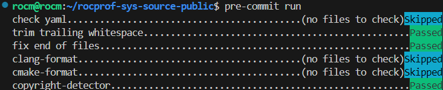

<head>
  <meta charset="UTF-8">
  <meta name="description" content="Contributing to rocprofiler-systems">
  <meta name="keywords" content="ROCm, contributing, rocprofiler-systems">
</head>

# Contributing to ROCm Systems Profiler #

Contributions to ROCm Systems Profiler are encouraged and welcomed.  Contributions at a basic level must conform to the MIT license and pass the code test requirements (i.e., ctest). The author must also be able to respond to comments/questions on the PR and make any changes requested.

## Issue Discussion ##

Please use the GitHub Issues tab to notify us of issues.

* Use your best judgement for issue creation. Search [existing issues](https://github.com/ROCm/rocm-systems/issues) to make sure your issue isn't already listed
* If your issue is already listed, upvote the issue and comment or post to provide additional details, such as how you reproduced this issue.
* If you're not sure if your issue is the same, err on the side of caution and file your issue. You can add a comment to include the issue number (and link) for the similar issue. If we evaluate your issue as being the same as the existing issue, we'll close the duplicate.
* If your issue doesn't exist, use the issue template to file a new issue.
* When filing an issue, be sure to provide as much information as possible, including script output so we can collect information about your configuration. This helps reduce the time required to reproduce your issue.
* Check your issue regularly, as we may require additional information to successfully reproduce the issue.
* You may also open an issue to ask questions to the maintainers about whether a proposed change meets the acceptance criteria, or to discuss an idea pertaining to the library.

## Acceptance Criteria ##

GitHub Issues are recommended for any significant change to the code base that adds a feature or fixes a non-trivial issue. If the code change is large without the presence of an issue (or prior discussion with AMD), the change may not be reviewed. Small fixes that fix broken behavior or other bugs are always welcome, with or without an associated issue.

## Pull Request Guidelines ##

By creating a pull request, you agree to the statements made in the [code license](#code-license) section. Your pull request should target the default branch. Our current default branch is the **develop** branch, which serves as our integration branch.

## Coding Style ##

* Use `clang-format-18` and `gersemi` formatters to ensure consistency.
  * The exact settings for these formatters must be the ones in this repository.

### Using pre-commit hooks ###

Our project supports [*pre-commit hooks*](https://pre-commit.com/#introduction) which developers can
leverage to automatically verify formatting before committing their change. Initial setup is as follows:

```shell
pip install pre-commit  # or: apt-get install pre-commit
cd rocprofiler-systems
pre-commit install
```

**Note:** pre-commit version **3.0.0 or higher** is required.

Now, these pre-commit checks must pass before a change can be committed.



Please see the [pre-commit documentation](https://pre-commit.com/#quick-start) for additional information.

## Code License ##

All code contributed to this project will be licensed under the license identified in the [License](LICENSE.md). Your contribution will be accepted under the same license.

## Release Cadence ##

Any code contribution to this library will be released with the next version of ROCm if the contribution window for the upcoming release is still open. If the contribution window is closed but the PR contains a critical security/bug fix, an exception may be made to include the change in the next release.

## References ##

1. [ROCm Systems Profiler Documentation](https://rocm.docs.amd.com/projects/rocprofiler-systems/en/latest/index.html)
2. [ROCm Systems Profiler README](README.md)
