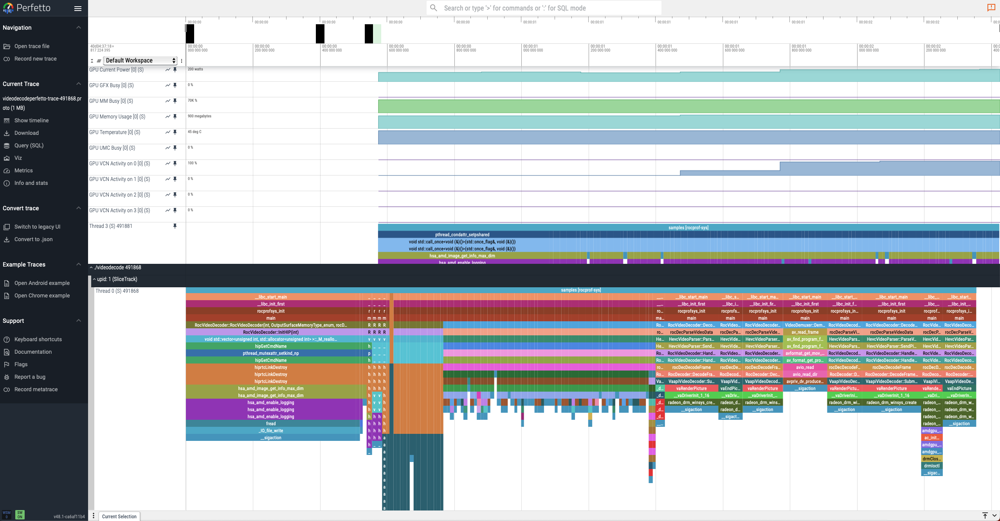
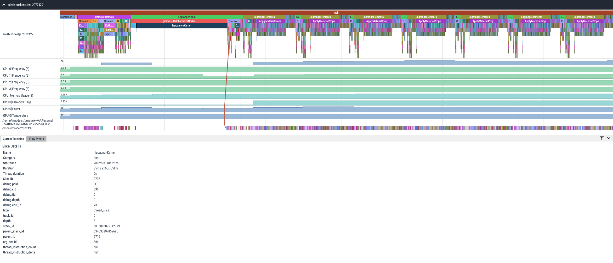
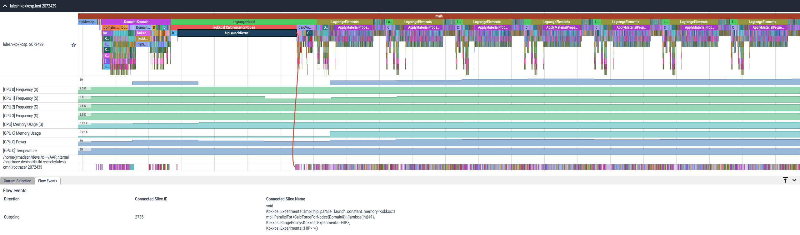
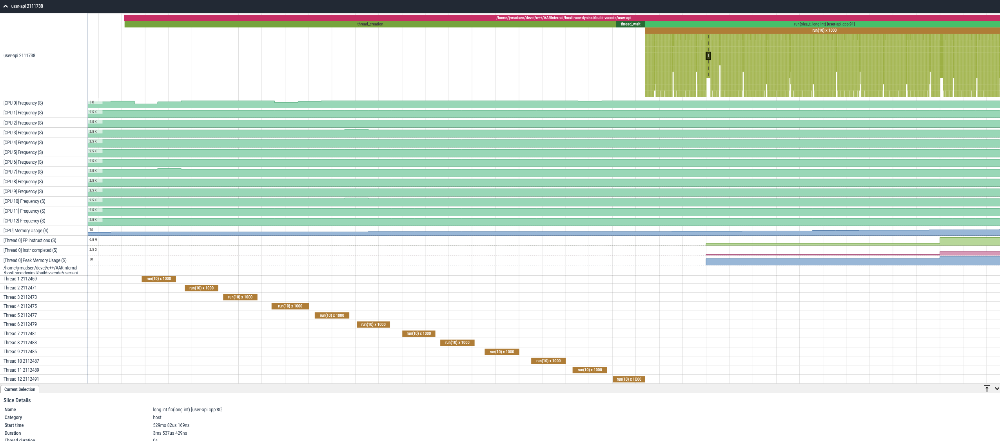

# ROCm Systems Profiler: Application profiling, tracing, and analysis

> [!NOTE]
> If you are using a version of ROCm prior to ROCm 6.3.1 and are experiencing problems viewing your trace in the latest version of [Perfetto](http://ui.perfetto.dev), then try using [Perfetto UI v46.0](https://ui.perfetto.dev/v46.0-35b3d9845/#!/).

## Overview

ROCm Systems Profiler (rocprofiler-systems), formerly Omnitrace, is a comprehensive profiling and tracing tool for parallel applications written in C, C++, Fortran, HIP, OpenCL, and Python which execute on the CPU or CPU+GPU.
It is capable of gathering the performance information of functions through any combination of binary instrumentation, call-stack sampling, user-defined regions, and Python interpreter hooks.
ROCm Systems Profiler supports interactive visualization of comprehensive traces in the web browser in addition to high-level summary profiles with mean/min/max/stddev statistics.
In addition to runtimes, ROCm Systems Profiler supports the collection of system-level metrics such as the CPU frequency, GPU temperature, and GPU utilization, process-level metrics
such as the memory usage, page-faults, and context-switches, and thread-level metrics such as memory usage, CPU time, and numerous hardware counters.

> [!NOTE]
> Full documentation is available at [ROCm Systems Profiler documentation](https://rocm.docs.amd.com/projects/rocprofiler-systems/en/latest/index.html) in an organized, easy-to-read, searchable format.
The documentation source files reside in the [`/docs`](/docs) folder of this repository. For information on contributing to the documentation, see
[Contribute to ROCm documentation](https://rocm.docs.amd.com/en/latest/contribute/contributing.html)

### Data collection modes

- Dynamic instrumentation
  - Runtime instrumentation
    - Instrument executable and shared libraries at runtime
  - Binary rewriting
    - Generate a new executable and/or library with instrumentation built-in
- Statistical sampling
  - Periodic software interrupts per-thread
- Process-level sampling
  - Background thread records process-, system- and device-level metrics while the application executes
- Causal profiling
  - Quantifies the potential impact of optimizations in parallel codes

### Data analysis

- High-level summary profiles with mean/min/max/stddev statistics
  - Low overhead, memory efficient
  - Ideal for running at scale
- Comprehensive traces
  - Every individual event/measurement
- Application speedup predictions resulting from potential optimizations in functions and lines of code (causal profiling)

### Parallelism API support

- HIP
- HSA
- Pthreads
- MPI
- RCCL
- UCX
- Kokkos-Tools (KokkosP)
- OpenMP-Tools (OMPT)

### GPU metrics

- GPU hardware counters
- HIP API tracing
- HIP kernel tracing
- HSA API tracing
- HSA operation tracing
- rocDecode API tracing
- rocJPEG API tracing
- System-level sampling (via AMD-SMI)
  - Memory usage
  - Power usage
  - Temperature
  - Utilization
  - VCN Utilization
  - JPEG Utilization
  - XGMI interconnect metrics (link width, link speed, read/write data)
  - PCIe metrics (link width, link speed, bandwidth)

> [!NOTE]
> The availability of VCN, JPEG, XGMI, and PCIe metrics depends on device support, system topology, and GPU architecture. If unsupported, all values will be reported as N/A in the output of `amd-smi metric --usage`.

### CPU metrics

- CPU hardware counters sampling and profiles
- CPU frequency sampling
- Various timing metrics
  - Wall time
  - CPU time (process and/or thread)
  - CPU utilization (process and/or thread)
  - User CPU time
  - Kernel CPU time
- Various memory metrics
  - High-water mark (sampling and profiles)
  - Memory page allocation
  - Virtual memory usage
- Network statistics
- I/O metrics
- ... many more

## Quick start

### Installation

See the [ROCm Systems Profiler installation guide](https://rocm.docs.amd.com/projects/rocprofiler-systems/en/latest/install/install.html) for detailed information.

### Setup

> [!NOTE]
> Replace `/opt/rocprofiler-systems` below with installation prefix as necessary.

- **Option 1**: Source `setup-env.sh` script

```bash
source /opt/rocprofiler-systems/share/rocprofiler-systems/setup-env.sh
```

- **Option 2**: Load modulefile

```bash
module use /opt/rocprofiler-systems/share/modulefiles
module load rocprofiler-systems
```

- **Option 3**: Manual

```bash
export PATH=/opt/rocprofiler-systems/bin:${PATH}
export LD_LIBRARY_PATH=/opt/rocprofiler-systems/lib:${LD_LIBRARY_PATH}
```

### Testing environment

The `build-docker` script can be used to create a testing environment. To see the available options, use the following commands:

```shell
cd docker
./build-docker.sh --help
```

> [!NOTE]
> The `-m` argument can be used to show supported OS + ROCm combinations.

**Example:** To set up an Ubuntu 24.04 + ROCm 6.4 + Python 3.12 environment for building and testing, run the following commands:

```shell
cd docker
./build-docker.sh --distro ubuntu --versions 24.04                               \
        --rocm-versions 6.4 --python-versions 12 --retry 1
docker run -v "$(cd .. && pwd)":/home/development                                \
        -it -w /home/development                                                 \
        --device /dev/kfd --device /dev/dri                                      \
        $(whoami)/rocprofiler-systems:release-base-ubuntu-24.04-rocm-6.4
```

Inside the container, clean, build, and install the project with testing enabled using the following commands:

```shell
rm -rf rocprof-sys-build
cmake -B rocprof-sys-build -S .                                                  \
       -D CMAKE_INSTALL_PREFIX=/opt/rocprofiler-systems                          \
       -D ROCPROFSYS_USE_PYTHON=ON      -D ROCPROFSYS_BUILD_DYNINST=ON           \
       -D ROCPROFSYS_BUILD_TBB=ON       -D ROCPROFSYS_BUILD_BOOST=ON             \
       -D ROCPROFSYS_BUILD_ELFUTILS=ON  -D ROCPROFSYS_BUILD_LIBIBERTY=ON         \
       -D ROCPROFSYS_BUILD_TESTING=ON
cmake --build rocprof-sys-build --target all --parallel 8
cmake --build rocprof-sys-build --target install
source /opt/rocprofiler-systems/share/rocprofiler-systems/setup-env.sh
```

> [!NOTE]
> If you see "dubious ownership" Git errors when working in the container, run:
>
> ```shell
> git config --global --add safe.directory /home/development
> ```
>
> and
>
> ```shell
> git config --global --add safe.directory /home/development/external/timemory
> ```

Then, use the following command to start automated testing:

```shell
ctest --test-dir rocprof-sys-build --output-on-failure
```

To enable MPI testing inside the container, set the following environment variables:

```shell
export OMPI_ALLOW_RUN_AS_ROOT=1
export OMPI_ALLOW_RUN_AS_ROOT_CONFIRM=1
```

For manual testing, you can find the executables in `rocprof-sys-build/bin`.

### ROCm Systems Profiler settings

Generate a rocprofiler-systems configuration file using `rocprof-sys-avail -G rocprof-sys.cfg`. Optionally, use `rocprof-sys-avail -G rocprof-sys.cfg --all` for
a verbose configuration file with descriptions, categories, etc. Modify the configuration file as desired, e.g. enable
[perfetto](https://perfetto.dev/), [timemory](https://github.com/ROCm/timemory), sampling, and process-level sampling by default
and tweak some sampling default values:

```console
# ...
ROCPROFSYS_TRACE                = true
ROCPROFSYS_PROFILE              = true
ROCPROFSYS_USE_SAMPLING         = true
ROCPROFSYS_USE_PROCESS_SAMPLING = true
# ...
ROCPROFSYS_SAMPLING_FREQ        = 50
ROCPROFSYS_SAMPLING_CPUS        = all
ROCPROFSYS_SAMPLING_GPUS        = $env:HIP_VISIBLE_DEVICES
```

Once the configuration file is adjusted to your preferences, either export the path to this file via `ROCPROFSYS_CONFIG_FILE=/path/to/rocprof-sys.cfg`
or place this file in `${HOME}/.rocprof-sys.cfg` to ensure these values are always read as the default. If you wish to change any of these settings,
you can override them via environment variables or by specifying an alternative `ROCPROFSYS_CONFIG_FILE`.

### Call-Stack sampling

The `rocprof-sys-sample` executable is used to execute call-stack sampling on a target application without binary instrumentation.
Use a double-hypen (`--`) to separate the command-line arguments for `rocprof-sys-sample` from the target application and it's arguments.

```shell
rocprof-sys-sample --help
rocprof-sys-sample <rocprof-sys-options> -- <exe> <exe-options>
rocprof-sys-sample -f 1000 -- ls -la
```

### Preset Profiling Modes

Instead of manually configuring numerous options, use preset modes optimized for common workloads:

**General Purpose:**

- **`--balanced`** - Balanced profiling with moderate overhead and comprehensive data
- **`--profile-only`** - Profiling-only mode without tracing (flat profile, minimal overhead)
- **`--detailed`** - Comprehensive profiling with full system metrics

**Workload-Specific:**

- **`--trace-hpc`** - Optimized for HPC/MPI/OpenMP applications
  - Automatically enables OMPT, MPIP, and relevant hardware counters
- **`--workload-trace`** - Optimized for AI/ML/GPU workloads which are supported by ROCm stack
  - Automatically enables GPU tracing, RCCL, and increases buffer sizes
- **`--trace-gpu`** - GPU workload analysis with host functions, MPI, and device activity
- **`--trace-openmp`** - OpenMP offload workloads with HSA domains
- **`--profile-mpi`** - MPI communication latency profiling
- **`--trace-hw-counters`** - Hardware counter collection during execution
  - Automatically enables tracing VALU utilization

**API Tracing:**

- **`--sys-trace`** - Comprehensive system API tracing
- **`--runtime-trace`** - Runtime API tracing
  - Excludes compiler and low-level HSA

**Example:**

```bash
# HPC application with MPI
mpirun -n 4 rocprof-sys-sample --trace-hpc -- ./mpi_app

# Balanced profiling with moderate overhead
rocprof-sys-sample --balanced -- ./myapp
```

### Pre-Execution Information

When using preset modes, ROCm Systems Profiler displays helpful information before execution:

- Which preset is active
- Where results will be saved
- How to visualize the results
- Warnings about potential issues (e.g., unwritable output directory)

### Smart Validation

The tools now validate your command-line options and provide clear guidance:

- **Preset conflict detection**: Warns if multiple conflicting presets are specified
- **Clear error messages**: Contextual help when problems occur
- **Actionable solutions**: Step-by-step troubleshooting for common issues

### Enhanced Help Text

All binaries now feature structured help organized by skill level:

- **Quick Start**: Get profiling immediately with minimal configuration
- **Workload-Specific**: Use presets optimized for your application type
- **Custom Configuration**: Advanced options for fine-grained control

### Binary instrumentation

The `rocprof-sys-instrument` executable is used to instrument an existing binary. Call-stack sampling can be enabled alongside
the execution an instrumented binary, to help "fill in the gaps" between the instrumentation via setting the `ROCPROFSYS_USE_SAMPLING`
configuration variable to `ON`.
Similar to `rocprof-sys-sample`, use a double-hypen (`--`) to separate the command-line arguments for `rocprof-sys-instrument` from the target application and it's arguments.

```shell
rocprof-sys-instrument --help
rocprof-sys-instrument <rocprof-sys-options> -- <exe-or-library> <exe-options>
```

#### Binary rewrite

Rewrite the text section of an executable or library with instrumentation:

```shell
rocprof-sys-instrument -o app.inst -- /path/to/app
```

In binary rewrite mode, if you also want instrumentation in the linked libraries, you must also rewrite those libraries.
Example of rewriting the functions starting with `"hip"` with instrumentation in the amdhip64 library:

```shell
mkdir -p ./lib
rocprof-sys-instrument -R '^hip' -o ./lib/libamdhip64.so.4 -- /opt/rocm/lib/libamdhip64.so.4
export LD_LIBRARY_PATH=${PWD}/lib:${LD_LIBRARY_PATH}
```

> [!NOTE]
> Verify via `ldd` that your executable will load the instrumented library. If you built your executable with an RPATH to the original library's directory, then prefixing `LD_LIBRARY_PATH` will have no effect.

Once you have rewritten your executable and/or libraries with instrumentation, you can just run the (instrumented) executable
or exectuable which loads the instrumented libraries normally, e.g.:

```shell
rocprof-sys-run -- ./app.inst
```

If you want to re-define certain settings to new default in a binary rewrite, use the `--env` option. This `rocprof-sys` option
will set the environment variable to the given value but will not override it. E.g. the default value of `ROCPROFSYS_PERFETTO_BUFFER_SIZE_KB`
is 1024000 KB (1 GiB):

```shell
# buffer size defaults to 1024000
rocprof-sys-instrument -o app.inst -- /path/to/app
rocprof-sys-run -- ./app.inst
```

Passing `--env ROCPROFSYS_PERFETTO_BUFFER_SIZE_KB=5120000` will change the default value in `app.inst` to 5120000 KiB (5 GiB):

```shell
# defaults to 5 GiB buffer size
rocprof-sys-instrument -o app.inst --env ROCPROFSYS_PERFETTO_BUFFER_SIZE_KB=5120000 -- /path/to/app
rocprof-sys-run -- ./app.inst
```

```shell
# override default 5 GiB buffer size to 200 MB via command-line
rocprof-sys-run --trace-buffer-size=200000 -- ./app.inst
# override default 5 GiB buffer size to 200 MB via environment
export ROCPROFSYS_PERFETTO_BUFFER_SIZE_KB=200000
rocprof-sys-run -- ./app.inst
```

#### Runtime instrumentation

Runtime instrumentation will not only instrument the text section of the executable but also the text sections of the
linked libraries. Thus, it may be useful to exclude those libraries via the `-ME` (module exclude) regex option
or exclude specific functions with the `-E` regex option.

```shell
rocprof-sys-instrument -- /path/to/app
rocprof-sys-instrument -ME '^(libhsa-runtime64|libz\\.so)' -- /path/to/app
rocprof-sys-instrument -E 'rocr::atomic|rocr::core|rocr::HSA' --  /path/to/app
```

### Python profiling and tracing

Use the `rocprof-sys-python` script to profile/trace Python interpreter function calls.
Use a double-hypen (`--`) to separate the command-line arguments for `rocprof-sys-python` from the target script and it's arguments.

```shell
rocprof-sys-python --help
rocprof-sys-python <rocprof-sys-options> -- <python-script> <script-args>
rocprof-sys-python -- ./script.py
```

> [!NOTE]
> The first argument after the double-hyphen must be a Python script, e.g. `rocprof-sys-python -- ./script.py`.

If you need to specify a specific python interpreter version, use `rocprof-sys-python-X.Y` where `X.Y` is the Python
major and minor version:

```shell
rpcprof-sys-python-3.8 -- ./script.py
```

If you need to specify the full path to a Python interpreter, set the `PYTHON_EXECUTABLE` environment variable:

```shell
PYTHON_EXECUTABLE=/opt/conda/bin/python rocprof-sys-python -- ./script.py
```

If you want to restrict the data collection to specific function(s) and its callees, pass the `-b` / `--builtin` option after decorating the
function(s) with `@profile`. Use the `@noprofile` decorator for excluding/ignoring function(s) and its callees:

```python
def foo():
    pass

@noprofile
def bar():
    foo()

@profile
def spam():
    foo()
    bar()
```

Each time `spam` is called during profiling, the profiling results will include 1 entry for `spam` and 1 entry
for `foo` via the direct call within `spam`. There will be no entries for `bar` or the `foo` invocation within it.

### Trace visualization

- Visit [ui.perfetto.dev](https://ui.perfetto.dev) in the web-browser
- Select "Open trace file" from panel on the left
- Locate the rocprofiler-systems perfetto output (extension: `.proto`)









## Using Perfetto tracing with system backend

Perfetto tracing with the system backend supports multiple processes writing to the same
output file. Thus, it is a useful technique if rocprofiler-systems is built with partial MPI support
because all the perfetto output will be coalesced into a single file. The
installation docs for perfetto can be found [here](https://perfetto.dev/docs/contributing/build-instructions).
If you are building rocprofiler-systems from source, you can configure CMake with `ROCPROFSYS_INSTALL_PERFETTO_TOOLS=ON`
and the `perfetto` and `traced` applications will be installed as part of the build process. However,
it should be noted that to prevent this option from accidentally overwriting an existing perfetto install,
all the perfetto executables installed by ROCm Systems Profiler are prefixed with `rocprof-sys-perfetto-`, except
for the `perfetto` executable, which is just renamed `rocprof-sys-perfetto`.

Enable `traced` and `perfetto` in the background:

```shell
pkill traced
traced --background
perfetto --out ./rocprof-sys-perfetto.proto --txt -c ${ROCPROFSYS_ROOT}/share/perfetto.cfg --background
```

> [!NOTE]
> If the perfetto tools were installed by rocprofiler-systems, replace `traced` with `rocprof-sys-perfetto-traced` and `perfetto` with `rocprof-sys-perfetto`.

Configure rocprofiler-systems to use the perfetto system backend via the `--perfetto-backend` option of `rocprof-sys-run`:

```shell
# enable sampling on the uninstrumented binary
rocprof-sys-run --sample --trace --perfetto-backend=system -- ./myapp

# trace the instrument the binary
rocprof-sys-instrument -o ./myapp.inst -- ./myapp
rocprof-sys-run --trace --perfetto-backend=system -- ./myapp.inst
```

or via the `--env` option of `rocprof-sys-instrument` + runtime instrumentation:

```shell
rocprof-sys-instrument --env ROCPROFSYS_PERFETTO_BACKEND=system -- ./myapp
```
