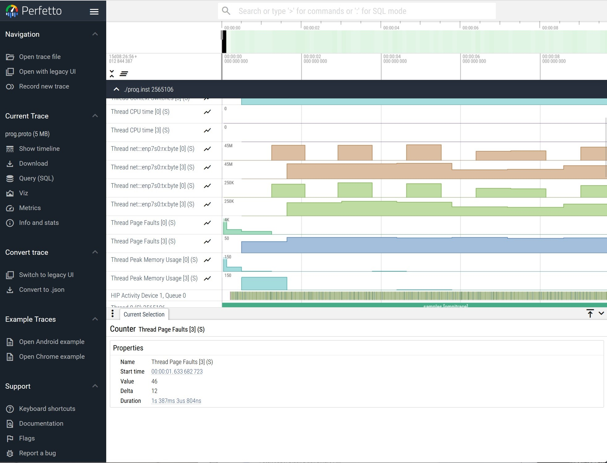

.. meta::
   :description: ROCm Systems Profiler network performance profiling
   :keywords: rocprof-sys, rocprofiler-systems, ROCm, tips, how to, profiler, tracking, NIC, network, AMD

********************************************
Network performance profiling
********************************************

`ROCm Systems Profiler <https://github.com/ROCm/rocm-systems/tree/develop/projects/rocprofiler-systems>`_ supports network profiling.

All network events that can be traced on the system can be listed by running the command:

.. code-block:: shell

    rocprof-sys-avail -H -r net

For example, if the system's NIC is enp7s0, then the output of this command looks like:

.. code-block:: shell

  |-------------------------------|---------|-----------|-------------------------------|
  |       HARDWARE COUNTER        | DEVICE  | AVAILABLE |            SUMMARY            |
  |-------------------------------|---------|-----------|-------------------------------|
  | net:::enp7s0:rx:byte          |   CPU   |   true    | enp7s0 receive byte           |
  | net:::enp7s0:rx:packet        |   CPU   |   true    | enp7s0 receive packet         |
  | net:::enp7s0:rx:error         |   CPU   |   true    | enp7s0 receive error          |
  | net:::enp7s0:rx:droppe        |   CPU   |   true    | enp7s0 receive droppe         |
  | net:::enp7s0:rx:fif           |   CPU   |   true    | enp7s0 receive fif            |
  | net:::enp7s0:rx:fram          |   CPU   |   true    | enp7s0 receive fram           |
  | net:::enp7s0:rx:compresse     |   CPU   |   true    | enp7s0 receive compresse      |
  | net:::enp7s0:rx:multicas      |   CPU   |   true    | enp7s0 receive multicas       |
  | net:::enp7s0:tx:byte          |   CPU   |   true    | enp7s0 transmit byte          |
  | net:::enp7s0:tx:packet        |   CPU   |   true    | enp7s0 transmit packet        |
  | net:::enp7s0:tx:error         |   CPU   |   true    | enp7s0 transmit error         |
  | net:::enp7s0:tx:droppe        |   CPU   |   true    | enp7s0 transmit droppe        |
  | net:::enp7s0:tx:fif           |   CPU   |   true    | enp7s0 transmit fif           |
  | net:::enp7s0:tx:coll          |   CPU   |   true    | enp7s0 transmit coll          |
  | net:::enp7s0:tx:carrie        |   CPU   |   true    | enp7s0 transmit carrie        |
  | net:::enp7s0:tx:compresse     |   CPU   |   true    | enp7s0 transmit compresse     |
  |-------------------------------|---------|-----------|-------------------------------|

To track bytes and packets sent and received by the NIC ``enp7s0``, the configuration parameters should be configured as the following example:

.. code-block:: shell

  ROCPROFSYS_PAPI_EVENTS = net:::enp7s0:tx:byte net:::enp7s0:rx:byte net:::enp7s0:tx:packet net:::enp7s0:rx:packet

Configuration
=============

A sample configuration parameter settings looks like:

.. code-block:: shell

  ROCPROFSYS_SAMPLING_FREQ=10
  ROCPROFSYS_USE_SAMPLING=ON
  ROCPROFSYS_TIMEMORY_COMPONENTS=wall_clock papi_array network_stats
  ROCPROFSYS_NETWORK_INTERFACE=enp7s0
  ROCPROFSYS_PAPI_EVENTS=net:::enp7s0:tx:byte net:::enp7s0:rx:byte net:::enp7s0:rx:packet net:::enp7s0:tx:packet

Details of the configuration parameter settings configured in the example are:

* **Sampling Frequency**: 10 samples per second
* **TIMEMORY**:  Outputs the summaries for the ``wall_clock``, ``papi_array``, and ``network_stats`` components.
* **Network Interface**: ``enp7s0`` is the predictable network interface device name.
* **Events for the network device to be sampled**: Bytes transmitted, bytes received, packets transmitted, and packets received.

The configuration parameter settings can be saved in a configuration file. Here is an example of a complete configuration file, ``rocprofsys.cfg``:

.. code-block:: shell

  ROCPROFSYS_VERBOSE=1
  ROCPROFSYS_DL_VERBOSE=1
  ROCPROFSYS_SAMPLING_FREQ=10
  ROCPROFSYS_SAMPLING_DELAY=0.05
  ROCPROFSYS_SAMPLING_CPUS=0-9
  ROCPROFSYS_SAMPLING_GPUS=$env:HIP_VISIBLE_DEVICES
  ROCPROFSYS_TRACE=ON
  ROCPROFSYS_PROFILE=ON
  ROCPROFSYS_USE_SAMPLING=ON
  ROCPROFSYS_USE_PROCESS_SAMPLING=OFF
  ROCPROFSYS_TIME_OUTPUT=OFF
  ROCPROFSYS_FILE_OUTPUT=ON
  ROCPROFSYS_TIMEMORY_COMPONENTS=wall_clock papi_array network_stats
  ROCPROFSYS_USE_PID=OFF
  ROCPROFSYS_OUTPUT_PREFIX=foo/
  ROCPROFSYS_NETWORK_INTERFACE=enp7s0
  ROCPROFSYS_PAPI_EVENTS = net:::enp7s0:tx:byte net:::enp7s0:rx:byte net:::enp7s0:rx:packet net:::enp7s0:tx:packet

To specify the configuration file, use the ``ROCPROFSYS_CONFIG_FILE`` setting:

.. code-block:: shell

  ROCPROFSYS_CONFIG_FILE=/path/to/rocprofsys.cfg

This setting defines the location of the ROCm Systems Profiler configuration file.

.. note::

   To collect network counters using Process Application Program Interface (PAPI), ensure that
   `/proc/sys/kernel/perf_event_paranoid` has a value <= 2. See
   :ref:`rocprof-sys_papi_events`
   for details.

Instrumenting and running a program
===================================

An example rocprof-sys-instrument command is:

.. code-block:: shell

  rocprof-sys-instrument -o foo.inst  \
    --log-file mylog.log --verbose --debug \
    "--print-instrumented" "functions" "-e" "-v" "2" "--caller-include" \
    "inner" "-i" "4096" "--" ./foo

This command generates an instrumented binary ``foo.inst``. Then, run
it with the following command:

.. code-block:: shell

  rocprof-sys-run -- ./foo.inst

To view the generated ``.proto`` file in the browser, open the
`Perfetto UI page <https://ui.perfetto.dev/>`_. Then, click on
``Open trace file`` and select the ``.proto`` file. In the browser, it looks
like this:

