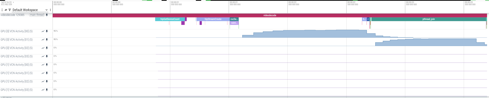
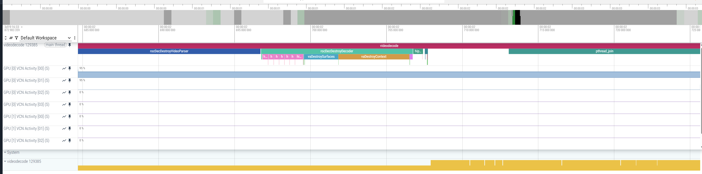
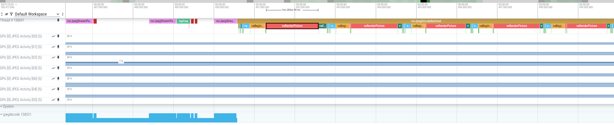

.. meta::
   :description: ROCm Systems Profiler VCN and JPEG activity sampling and tracing
   :keywords: rocprof-sys, rocprofiler-systems, ROCm, tips, how to, profiler, tracking, VCN, JPEG, rocDecode, rocjpeg, AMD

********************************************
VCN and JPEG activity sampling and tracing
********************************************

`ROCm Systems Profiler <https://github.com/ROCm/rocm-systems/tree/develop/projects/rocprofiler-systems>`_ supports
sampling of VCN and JPEG engines activities. It allows you to gather key performance metrics for
VCN utilization and understand engine usage through visualization. This information can be used
to optimize media and video workloads. Additionally, it supports tracing of `rocDecode
<https://rocm.docs.amd.com/projects/rocDecode/en/latest/>`_ APIs, `rocJPEG
<https://rocm.docs.amd.com/projects/rocJPEG/en/latest/>`_ APIs, and the
Video Acceleration APIs (VA-APIs). Tracing these APIs provides insights into how different
components of the video encoding and decoding workloads interact with the VCN engine.

Sampling support
=================

Sampling of VCN and JPEG engine activity is supported by leveraging `AMD SMI <https://rocm.docs.amd.com/projects/amdsmi/en/latest/>`_ which provides the interface for GPU metric collection.

1. Set the ``ROCPROFSYS_USE_AMD_SMI`` environment variable to enable GPU metric collection:

.. code-block:: shell

  export ROCPROFSYS_USE_AMD_SMI=true

2. Update the ``ROCPROFSYS_AMD_SMI_METRICS`` variable to collect the VCN and JPEG activity metrics. The default value is:

.. code-block:: shell

  ROCPROFSYS_AMD_SMI_METRICS=busy,temp,power,mem_usage

To include VCN and JPEG activity metrics, update it to:

.. code-block:: shell

  ROCPROFSYS_AMD_SMI_METRICS=busy,temp,power,mem_usage,vcn_activity,jpeg_activity

Alternatively, you can use the following to collect all available GPU metrics:

.. code-block:: shell

  ROCPROFSYS_AMD_SMI_METRICS=all

API tracing support
=====================

Tracing of rocDecode and rocJPEG APIs is supported by leveraging `ROCprofiler-SDK <https://rocm.docs.amd.com/projects/rocprofiler-sdk/en/latest/index.html>`_
which provides runtime-independent APIs for tracing the runtime calls and asynchronous activities associated with decoder activities and workload in VCN and JPEG engines.

To enable tracing for the rocDecode and rocJPEG APIs, update the ``ROCPROFSYS_ROCM_DOMAINS`` variable. The default value is:

.. code-block:: shell

  ROCPROFSYS_ROCM_DOMAINS=hip_runtime_api,marker_api,kernel_dispatch,memory_copy,scratch_memory,page_migration

Add ``rocdecode_api`` and ``rocjpeg_api`` to include tracing for rocDecode and rocJPEG APIs:

.. code-block:: shell

  ROCPROFSYS_ROCM_DOMAINS=hip_runtime_api,marker_api,kernel_dispatch,memory_copy,scratch_memory,page_migration,rocdecode_api,rocjpeg_api

.. note::

   By default, enabling ``rocdecode_api`` or ``rocjpeg_api`` also enables VA-API tracing.

To explore all supported tracing domains, use the command:

.. code-block:: shell

  rocprof-sys-avail -bd -r ROCM_DOMAINS

For more details on the APIs, refer to `ROCprofiler-SDK Developer Docs <https://rocm.docs.amd.com/projects/rocprofiler-sdk/en/latest/_doxygen/rocprofiler-sdk/html/>`_.

Using rocDecode and rocJPEG samples
================================================

For testing purposes, you can use the `rocDecode samples <https://github.com/ROCm/rocDecode?tab=readme-ov-file#using-sample-application>`_
and `rocJPEG samples <https://github.com/ROCm/rocJPEG?tab=readme-ov-file#using-sample-application>`_.
For generating sufficient load for VCN and JPEG engines, you can use the following samples:

For video decoding:
  - `Video decode batch <https://github.com/ROCm/rocDecode/tree/develop/samples/videoDecodeBatch>`_
  - `Video decode performance <https://github.com/ROCm/rocDecode/tree/develop/samples/videoDecodePerf>`_

For JPEG decoding:
  - `JPEG decode batched <https://github.com/ROCm/rocJPEG/tree/develop/samples/jpegDecodeBatched>`_
  - `JPEG decode perf <https://github.com/ROCm/rocJPEG/tree/develop/samples/jpegDecodePerf>`_

After completing the build steps mentioned in the sample documentation, proceed with the following steps:

1. Source the ROCm Systems Profiler Environment using:

.. code-block:: shell

   source /opt/rocprofiler-systems/share/rocprofiler-systems/setup-env.sh

Alternatively, if you are using modules, use:

.. code-block:: shell

   module use /opt/rocprofiler-systems/share/modulefiles

2. Generate and configure the profiler config file.

.. code-block:: shell

   rocprof-sys-avail -G $HOME/.rocprofsys.cfg -F txt
   export ROCPROFSYS_CONFIG_FILE=$HOME/.rocprofsys.cfg

Edit ``.rocprofsys.cfg`` with the following settings:

.. code-block:: shell

  ROCPROFSYS_USE_AMD_SMI     = true
  ROCPROFSYS_AMD_SMI_METRICS = busy,temp,power,mem_usage,vcn_activity,jpeg_activity
  ROCPROFSYS_ROCM_DOMAINS    = hip_runtime_api,marker_api,kernel_dispatch,memory_copy,scratch_memory,page_migration,rocdecode_api,rocjpeg_api

3. Profile the rocDecode sample.

.. code-block:: shell

  rocprof-sys-sample -PTHD -- ./videodecodebatch -i /opt/rocm/share/rocdecode/video/

.. note::

   If the ``rocdecode-dev`` package is installed, then the sample videos will be located in ``/opt/rocm/share/rocdecode/video``, by default.

At the end of the run, a similar message appears::

  [rocprofiler-systems][964294][perfetto]> Outputting '/home/demo/rocprofsys-videodecodebatch-output/2025-04-25_15.52/perfetto-trace-964294.proto'
  (2792.91 KB / 2.79 MB / 0.00 GB)... Done

To view the generated ``.proto`` file in the browser, open the
`Perfetto UI page <https://ui.perfetto.dev/>`_. Then, click on
``Open trace file`` and select the ``.proto`` file. In the browser, a similar visualization is generated.

4. To profile the rocJPEG sample, use:

.. code-block:: shell

  rocprof-sys-sample -v 2 -PTHD -- ./jpegdecodeperf -i /opt/rocm/share/rocjpeg/image/

.. note::

  If ``rocjpeg-dev`` package is installed, the sample images will be located in the
  ``/opt/rocm/share/rocjpeg/image/`` directory.
  Duplicate the images to generate enough workload to see activity in the trace

