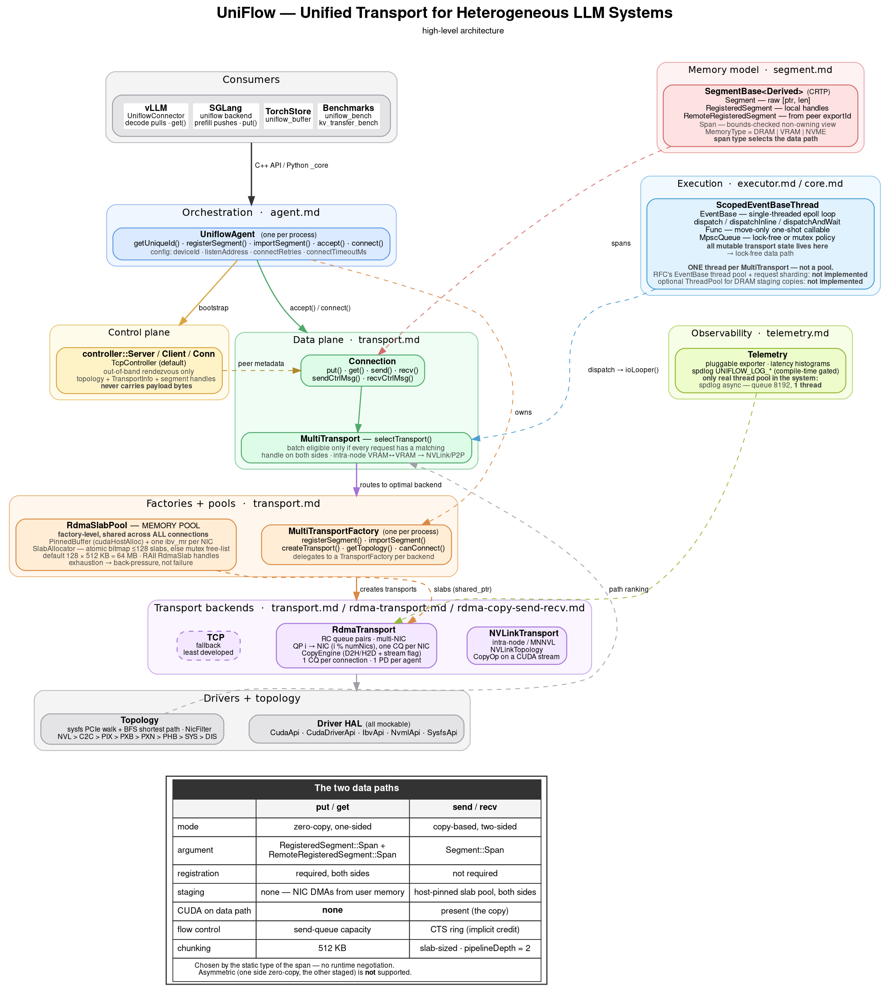

# UniFlow Developer Onboarding Guide

Entry point for engineers contributing to UniFlow or extending it for new
platforms.

> **UniFlow** (Unified Transport for Heterogeneous LLM Systems) is a host-based
> point-to-point data transfer library for LLM workloads — disaggregated
> inference, RL tensor transfer, and checkpoint retrieval/loading.

---

## Table of Contents

- [Architecture at a Glance](#architecture-at-a-glance)
- [Document Map](#document-map)
- [Codebase Layout](#codebase-layout)
- [Building and Hello World](#building-and-hello-world)
- [Running Tests](#running-tests)
- [Performance Benchmarking](#performance-benchmarking)
- [Extending the RDMA Backend for New HW](#extending-the-rdma-backend-for-new-hw)
- [Adding a New Backend](#adding-a-new-backend)
- [Glossary](#glossary)
- [Further Reading](#further-reading)

---

## Architecture at a Glance



Generated with graphviz from [`uniflow-arch.dot`](uniflow-arch.dot); regenerate with:

```bash
dot -Tpng -Gdpi=140 fbcode/comms/uniflow/docs/uniflow-arch.dot \
  -o fbcode/comms/uniflow/docs/uniflow-arch.png
```

### The two data paths

Chosen by the **static type of the span** — there is no runtime negotiation.
Asymmetric transfer (one side zero-copy, the other staged) is **not** supported.

| | `put` / `get` | `send` / `recv` |
|---|---|---|
| mode | zero-copy, one-sided | copy-based, two-sided |
| argument | `RegisteredSegment::Span` + `RemoteRegisteredSegment::Span` | `Segment::Span` |
| registration | required, both sides | not required |
| staging | none — NIC DMAs from user memory | host-pinned slab pool, both sides |
| CUDA on data path | **none** | present (the copy) |
| flow control | send-queue capacity | CTS ring (implicit credit) |
| chunking | 512 KB | slab-sized, `pipelineDepth = 2` |

### How to read the diagram

The **vertical spine** is the request path. A consumer calls `UniflowAgent`,
which splits into a control plane (rendezvous) and a data plane
(`Connection` → `MultiTransport`); `MultiTransport` picks a backend, the factory
creates it, and the backend drives the drivers.

**Dashed edges** are cross-cutting — memory model, execution, observability, and
the slab pool. They are not layers; they cut across every layer.

Five things the diagram is trying to make obvious:

1. **The control plane never carries payload bytes.** It exchanges topology,
   `TransportInfo`, and segment handles, then gets out of the way. That
   separation is what lets the data plane be lock-free.
2. **The static type of the span selects the data path** — see the table above.
3. **`put`/`get` puts no CUDA call on the data path. `send`/`recv` does.** That
   single row explains most of the performance and reliability difference
   between them.
4. **The slab pool is factory-level**, shared across every connection — not
   per-transport. Transports hold a `shared_ptr` into it.
5. **There is one EventBase thread, not a pool.** All mutable transport state
   lives on it, which is what makes the data path lock-free. The RFC describes a
   thread pool with request sharding; it is not implemented.

---

## Document Map

Design documentation lives in [`../.claude/docs/`](../.claude/docs/). Start with
`overview.md`, then read the deep-dive for whatever you are touching.

| Document | Contents |
|---|---|
| [`overview.md`](../.claude/docs/overview.md) | **Start here.** Goals, non-goals, integrations, key differentiators vs OSS |
| [`segment.md`](../.claude/docs/segment.md) | Memory model — `Segment`, `TSpan`, `RegisteredSegment`, `RemoteRegisteredSegment` |
| [`transport.md`](../.claude/docs/transport.md) | `Transport` / `TransportFactory` interfaces, backend types, connection lifecycle |
| [`agent.md`](../.claude/docs/agent.md) | `UniflowAgent` design, configuration, connection establishment, threading model |
| [`executor.md`](../.claude/docs/executor.md) | `Func`, `Executor`, `EventBase`, `ScopedEventBaseThread` |
| [`core.md`](../.claude/docs/core.md) | Core primitives, and what does *not* belong in core |
| [`rdma-transport.md`](../.claude/docs/rdma-transport.md) | Zero-copy `put`/`get` path — multi-QP distribution, selective signaling, SQ flow control, task lifecycle |
| [`rdma-copy-send-recv.md`](../.claude/docs/rdma-copy-send-recv.md) | Copy-based `send`/`recv` — slab pool, CTS ring, notify ring, pipelining |
| [`fault-model.md`](../.claude/docs/fault-model.md) | Error contract, timeout semantics, and the launch-side blocking hazard |
| [`telemetry.md`](../.claude/docs/telemetry.md) | Telemetry and latency-measurement design |

Elsewhere in the tree:

| Document | Contents |
|---|---|
| [`../benchmarks/DESIGN.md`](../benchmarks/DESIGN.md) | Benchmark suite design — **read as history, see the benchmarking section below** |

---

## Codebase Layout

```
comms/uniflow/
├── Uniflow.h/cpp          UniflowAgent — top-level per-process orchestrator
├── Connection.h/cpp       User-facing connection (control + data plane)
├── MultiTransport.h/cpp   Aggregates backends, routes to the optimal transport
├── Segment.h/cpp          Memory abstraction (DRAM, VRAM, NVMe)
├── Result.h               Error handling (Status, Result<T>, ErrCode)
├── UniflowPy.cpp          pybind11 bindings → the `_core` Python extension
├── controller/            Control plane (TCP-based rendezvous)
├── executor/              Async primitives (Func, EventBase, ScopedEventBaseThread)
├── core/                  Low-level utilities (MpscQueue, Func)
├── logging/               spdlog async logger behind UNIFLOW_LOG_* macros
├── transport/
│   ├── Transport.h        Abstract transport + TransportFactory interfaces
│   ├── TransportType.h    NVLink | RDMA | TCP | Mock
│   ├── Topology.h/cpp     PCIe/NIC topology discovery (GPU↔NIC affinity)
│   ├── rdma/              RDMA backend — RdmaTransport, RdmaSlabPool, CopyEngine
│   ├── nvlink/            NVLink backend — NVLinkTransport, NVLinkTopology
│   └── p2p/               Shared P2P helpers
├── drivers/               Hardware abstraction (cuda, ibverbs, nvml, sysfs), all mockable
├── tests/                 unit/ · integration/ · py/
├── benchmarks/            Performance benchmark suite (see below)
├── amd/                   AMD-specific pieces
└── .claude/docs/          Design documentation
```

---

## Building and Hello World

### Prerequisites

- devserver or on-demand with GPU access (≥2 GPUs for NVLink tests)
- Buck2

### Build

```bash
buck2 build fbcode//comms/uniflow:uniflow      # core library
buck2 build fbcode//comms/uniflow:_core        # Python extension
```

### Hello World (requires 2 GPUs)

The Python integration test exercises the full path — agent creation, segment
registration, connection, transfer, verification:

```bash
buck2 test fbcode//comms/uniflow/tests/py:test_uniflow_integration
```

It creates two `UniflowAgent` instances, registers GPU memory on each,
establishes a connection via the TCP controller, performs a `get()` from GPU:0
to GPU:1 over NVLink, and verifies the data.

The C++ equivalent:

```bash
buck2 test fbcode//comms/uniflow/tests/integration:multi_transport_single_host_test
```

---

## Running Tests

```bash
# No hardware required
buck2 test fbcode//comms/uniflow/tests/unit:
buck2 test fbcode//comms/uniflow/executor/tests:
buck2 test fbcode//comms/uniflow/controller/tests:
buck2 test fbcode//comms/uniflow/core/tests:
buck2 test fbcode//comms/uniflow/drivers/ibverbs/tests:
buck2 test fbcode//comms/uniflow/drivers/cuda/tests:
buck2 test fbcode//comms/uniflow/drivers/nvml/tests:
buck2 test fbcode//comms/uniflow/logging/tests:
buck2 test fbcode//comms/uniflow/transport/tests:
buck2 test fbcode//comms/uniflow/transport/rdma/tests:
buck2 test fbcode//comms/uniflow/transport/nvlink/tests:
buck2 test fbcode//comms/uniflow/transport/p2p/tests:

# GPUs required
buck2 test fbcode//comms/uniflow/tests/integration:multi_transport_single_host_test   # ≥2 GPUs, 1 host
buck2 test fbcode//comms/uniflow/tests/integration:multi_transport_cross_host_test    # 2 nodes
```

CMake / OSS builds are supported per module; see `CMakeLists.txt`. **When adding
a file, update both `BUCK` and `CMakeLists.txt`.**

---

## Performance Benchmarking

`benchmarks/` holds **two largely independent tracks** that share a directory
and little else.

### Track 1 — C++ transport microbenchmarks (`uniflow_bench`)

Six benchmarks, registered in `benchmarks/main.cpp`:

| Name | Platform | Measures |
|---|---|---|
| `rdma_bandwidth` | both | RDMA put/get, multi-NIC, multi-GPU aggregate, Data Direct |
| `sendrecv_bandwidth` | both (hipified) | Copy-based slab-staged send/recv, fan-out/fan-in |
| `nvlink_bandwidth` | NVIDIA | NVLink put/get |
| `connection_setup` | NVIDIA | bind/connect cycle cost |
| `nccl_sendrecv` | NVIDIA | NCCL baseline for comparison |
| `xgmi_bandwidth` | AMD | HIP IPC over XGMI |

```bash
buck2 build fbcode//comms/uniflow/benchmarks:uniflow_bench
buck2 run  fbcode//comms/uniflow/benchmarks:uniflow_bench -- --list   # authoritative names

# launcher scripts, from the repo root
bash fbcode/comms/uniflow/benchmarks/scripts/run_nvlink_benchmark.sh          # local 2-GPU
bash fbcode/comms/uniflow/benchmarks/scripts/run_sendrecv_benchmark.sh
bash fbcode/comms/uniflow/benchmarks/scripts/rdma_benchmark.sh --host0 <h0> --host1 <h1>   # vs ib_write_bw
```

The binary is launcher-agnostic: it reads `MASTER_ADDR`, `MASTER_PORT`, `RANK`,
`WORLD_SIZE`, `LOCAL_RANK`, so torchrun or a plain shell script both work.
Rendezvous uses UniFlow's own `TcpController` — no c10d, folly, or MPI.

**Two structural facts worth knowing before you read the code:**

- `BenchmarkRunner` is a 68-line registry. It does *not* own the size sweep,
  warmup, or barriers — each benchmark implements its own loop, which is why
  `bench/*.cpp` files are 600–1000 lines each. Only `generateSizes()` is shared.
- `Rendezvous` returns **control channels only**. Each benchmark does its own
  transport bind/connect and memory registration.

**What layer is measured:** no C++ benchmark includes `Uniflow.h`,
`Connection.h`, or `MultiTransport.h`. They drive `RdmaTransport` /
`NVLinkTransport` directly, using the `SegmentHelper.h` friend-class hack to
build a `RegisteredSegment` outside the agent. The suite measures the transport
layer in isolation — there is no C++ benchmark of the full user-facing stack.

Two constraints worth knowing before editing these:
`SegmentHelper.h` names its class `SegmentTest` purely to satisfy a `friend`
declaration in `Segment.h` — the name is load-bearing, do not rename it. And the
NVIDIA-only benchmarks are compiled out on AMD via `__HIP_PLATFORM_AMD__`, so an
unguarded include breaks the other platform's build.

Undocumented but working flags: `--batch-size`, `--tx-depth`, `--num-nics`,
`--chunk-size`, `--loop-count`, `--bidirectional`, `--topology fanout|fanin`,
`--pipeline-depth`, `--slab-size`, `--slab-num`, `--data-direct`,
`--cuda-devices`, `--gpu-nics`.

### Track 2 — Python KV-transfer bench

`benchmarks/py/kv_transfer_bench.py` — a `python_unittest_remote_gpu` with
`gpus = 2`. The only benchmark exercising the **public** API (`UniflowAgent` →
`register_segment` → `export_id` → connect → `conn.get(requests=[...])`). Models
KV-cache shape directly and verifies correctness before timing.

```bash
buck2 test fbcode//comms/uniflow/benchmarks/py:kv_transfer_bench
```

## Extending the RDMA Backend for New HW

Three extension points: **topology discovery**, **NIC filtering**, and **device
adaptation**.

### 1. Topology discovery (`transport/Topology.h/.cpp`)

`Topology.h` defines the graph model — `TopoNode` (GPU/CPU/NIC), `TopoLink`,
`PathType`. `Topology.cpp` builds it by enumerating CUDA devices and IB devices,
walking sysfs for PCIe ancestry, running BFS shortest-path, and probing PCIe
link speed for bandwidth weights.

| Step | Action | Where |
|---|---|---|
| 1 | Add a driver wrapper for your device's enumeration API | `drivers/<your_hw>/` |
| 2 | Expose PCIe BDF discovery so topology can find your device | your driver |
| 3 | Register nodes in the topology builder | `Topology.cpp` |
| 4 | Update `NicFilter` if your NIC naming differs | `Topology.h` |

`PathType`, best to worst: `NVL > C2C > PIX > PXB > PXN > PHB > SYS > DIS`.

### 2. Device adapter (`drivers/DeviceAdapter.h`)

```cpp
class DeviceAdapter {
 public:
  // Host-pinned allocation for DMA
  virtual Result<void*> pinnedHostAlloc(size_t size) = 0;
  virtual Status pinnedHostFree(void* ptr) = 0;
  virtual Result<void*> hostGetDevicePointer(void* hostPtr) = 0;

  // DMA-BUF export, for GPUDirect registration
  virtual Result<bool> isDmaBuffSupported(int deviceId) = 0;
  virtual Result<DmaBuff> exportDmaBuff(...) = 0;
  virtual Status closeDmaBuff(DmaBuff& buff) = 0;

  // Optional overrides — both have defaults
  virtual uint64_t resolveDevicePointer(const void* ptr) const noexcept;
  virtual bool allowsRegMrFallback() const noexcept;
};
```

Platform selection is a Buck `select()` in `drivers/BUCK`:

```python
oss_cpp_library(
    name = "device-adapter",
    exported_deps = [":device-adapter-interface"] + select({
        "DEFAULT": ["//comms/uniflow/drivers/cuda:cuda-device-adapter"],
        "ovr_config//gpu:mtia": ["//comms/uniflow/fb:mtia-device-adapter"],
    }),
)
```

To add a platform: implement `DeviceAdapter` in `drivers/<your_hw>/`, add a
`select()` entry, and implement `createDeviceAdapter()`.

### 3. Testing a new HW integration

1. **Unit tests** — mock the driver APIs (`drivers/ibverbs/mock/`,
   `drivers/cuda/mock/`).
2. **Topology test** — validate GPU↔NIC path detection for your PCIe layout.
3. **Integration** — follow the `multi_transport_single_host_test` pattern.
4. **Benchmark** — run `rdma_benchmark.sh` to validate bandwidth.

---

## Adding a New Backend

Create `transport/<backend>/`:

```
transport/<backend>/
├── <Backend>Transport.h
├── <Backend>Transport.cpp
├── BUCK
└── CMakeLists.txt
```

Implement the two core interfaces from `transport/Transport.h`.

**`Transport`** — data plane, one instance per connection:

```cpp
class MyTransport : public Transport {
  const std::string& name() const noexcept override;
  TransportType transportType() const noexcept override;
  TransportState state() const noexcept override;
  TransportInfo bind() override;                                // Serialize local endpoint
  Status connect(std::span<const uint8_t> remoteInfo) override; // Connect to peer

  // Batch transfer operations
  std::future<Status> put(std::span<const TransferRequest>, ...) override;
  std::future<Status> get(std::span<const TransferRequest>, ...) override;

  // Zero-copy send/recv — registered memory
  std::future<Status> send(RegisteredSegment::Span, ...) override;
  std::future<Status> recv(RegisteredSegment::Span, ...) override;

  // Copy-based send/recv — unregistered memory, staged through slabs
  std::future<Status> send(Segment::Span, ...) override;
  std::future<Status> recv(Segment::Span, ...) override;

  void shutdown() override;
};
```

**`TransportFactory`** — lifecycle management, one per process:

```cpp
class MyTransportFactory : public TransportFactory {
  Result<std::unique_ptr<RegistrationHandle>> registerSegment(Segment&) override;
  Result<std::unique_ptr<RemoteRegistrationHandle>> importSegment(...) override;
  Result<std::unique_ptr<Transport>> createTransport(std::span<const uint8_t> peerTopology) override;
  std::vector<uint8_t> getTopology() override;
  Status canConnect(std::span<const uint8_t> peerTopology) override;
};
```

Then:

1. Add your backend to `transport/TransportType.h`.
2. In `MultiTransport.cpp`, add a `supported()` check, instantiate your factory
   in the `MultiTransportFactory` constructor, and add topology
   serialization to `getTopology()` / `parse()`.
3. Add tests — a mock-based unit test in `transport/<backend>/tests/`, a case in
   `tests/integration/MultiTransportSingleHostTest.cpp`, and a
   `<Backend>BandwidthBenchmark` in `benchmarks/bench/`.

Reference implementations: `transport/nvlink/` (simpler, GPU-only) and
`transport/rdma/` (full-featured, multi-NIC).

---

## Glossary

| Term | Meaning |
|---|---|
| **Chunk** | A 512 KB subdivision of a `TransferRequest` for multi-QP distribution (put/get path). |
| **Slab** | A fixed-size staging buffer from the shared pool (send/recv path). Distinct from chunk. |
| **CTS** | Clear-To-Send. Receiver-to-sender ring advertising allocated recv slabs; doubles as flow control. |
| **Notify ring** | Sender-to-receiver ring carrying a monotonic completed-slab counter. |
| **Spray** | Distributing WRs across QPs in proportion to available send-queue capacity. |
| **Flush WR** | A WR posted after a partial post failure so the HCA still emits a CQE for consumed unsignaled WRs. |
| **Segment / Span** | A registered memory region / a bounds-checked non-owning view into one. |
| **PathType** | Topology path classification, `NVL > C2C > PIX > PXB > PXN > PHB > SYS > DIS`. |
| **Zero-copy** | NIC DMAs directly from registered user memory. No CUDA call on the data path. |
| **Copy-based** | User memory is staged through host-pinned slabs. A CUDA copy enters the data path. |

---

---

## Further Reading

| Resource | Link |
|---|---|
| Benchmark design | [`../benchmarks/DESIGN.md`](../benchmarks/DESIGN.md) |
| Coding standards | [`../.claude/CLAUDE.md`](../.claude/CLAUDE.md) |

### Key design principles

- **No folly** — C++20 standard library only (OSS portability)
- **Lock-free data path** — all mutable state on the EventBase thread
- **Mockable drivers** — each HW driver has a mock in `drivers/<hw>/mock/`
- **Topology-aware routing** — `MultiTransport` picks the backend automatically
